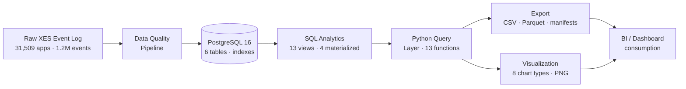

# Operations Analytics Pipeline — Loan Application Process Analysis

An end-to-end analytics pipeline that ingests a real-world loan application event log (31,509 applications, 1.2M events), validates data quality, loads it into PostgreSQL, and produces analytical insights through SQL views, Python queries, CSV/Parquet exports, and matplotlib visualizations.

Built to demonstrate practical data analytics skills: data quality engineering, database design, SQL analytics, Python data pipelines, export automation, and operational KPI visualization.

---

## Overview

This project takes a real operational dataset — the [BPI Challenge 2017](https://data.4tu.nl/articles/dataset/BPI_Challenge_2017/12696884) loan application event log from a Dutch financial institution — and builds a complete analytics stack around it.

The pipeline answers practical business questions about operational performance: How many applications are processed each month? Where do bottlenecks occur? How long do applications take to complete? Which resources handle the most workload? What are the most common outcomes?

Each layer is independently testable, and the entire system runs against real data, not synthetic placeholders.

## Business Problem

Financial institutions process thousands of loan applications through multi-step workflows involving validation, offer generation, and lifecycle management. Understanding operational performance — volume trends, processing times, resource utilization, and outcome distribution — is essential for identifying bottlenecks and improving throughput.

This project analyzes 13 months of loan application events (January 2016 – February 2017) to answer questions a data or operations analyst would ask when reviewing process performance.

## Key Questions Answered

- How many loan applications are processed, and how many events occur per application?
- What is the distribution of application types (new credit vs. limit raise)?
- How does application volume change month-over-month?
- How long do applications take to process, and what is the typical duration bucket?
- Which workflow activities generate the most events?
- How is workload distributed across resources (staff/system actors)?
- What are the lifecycle outcomes (complete, suspend, withdraw)?
- How do different loan purposes compare in volume and processing time?

## Dataset

| Attribute | Value |
|-----------|-------|
| **Source** | [BPI Challenge 2017](https://doi.org/10.4121/uuid:5f3067df-f10b-45da-b98b-86ae4c7a310b) |
| **Publisher** | Eindhoven University of Technology / 4TU.ResearchData |
| **Format** | XES event log (gzip-compressed XML) |
| **Time coverage** | January 2016 – February 2017 |
| **Applications** | 31,509 unique loan application cases |
| **Events** | 1,202,267 workflow events |
| **Application types** | New credit, Limit raise |
| **Activities** | 26 distinct workflow activities (W\_/O\_/A\_ prefixes) |
| **Resources** | 149 anonymized actors/systems |
| **License** | 4TU General Terms of Use |

The raw XES file is not committed to Git. Provenance metadata is tracked in [`data/source_manifest.json`](data/source_manifest.json), and a download script with checksum verification is provided.

## Solution Architecture



Each layer consumes the output of the previous layer. The Python query layer never duplicates SQL — it reads from views. Exports and visualizations both consume the query layer, producing portable artifacts.

## Technology Stack

| Category | Technologies |
|----------|-------------|
| **Database** | PostgreSQL 16.15 |
| **SQL** | Analytical views, materialized views, window functions, aggregations |
| **Python** | 3.11+, psycopg 3, SQLAlchemy 2.0, pandas, NumPy |
| **Data quality** | Streaming XES parser (xml.etree), 12-rule validation catalog |
| **Export** | CSV (UTF-8), Parquet (PyArrow) |
| **Visualization** | Matplotlib, Seaborn (non-interactive Agg backend) |
| **Configuration** | pydantic-settings, python-dotenv, Docker Compose (database) |
| **Testing** | pytest, pytest-cov |
| **Packaging** | pyproject.toml, setuptools (editable install) |

## Data Quality

The quality pipeline uses a non-destructive, streaming approach — it reads the compressed XES file via `iterparse` without loading the full 1.2M events into memory.

**12 validation rules** cover:

| Category | Checks |
|----------|--------|
| **Identity** | Missing trace/event IDs, duplicate IDs |
| **Timestamps** | Null timestamps, non-monotonic sequences, impossible durations |
| **Content** | Missing activities |
| **Scope** | Orphaned events (no matching trace), synthetic field presence |
| **Aggregation** | Trace counts, event counts, bounded examples per rule |

**Verified results against the BPI Challenge 2017 data:**

- 31,509 traces checked
- 1,202,267 events checked
- 0 quarantine candidates
- 0 error or warning rule violations

Issues are reported in a quarantine manifest for review — the pipeline never deletes or mutates records.

## Database & SQL Analytics

### Schema (6 tables)

| Table | Purpose |
|-------|---------|
| `applications` | One row per loan application (31,509 rows) |
| `events` | One row per workflow event (1,202,267 rows, FK to applications) |
| `offers` | Optional offer records per application |
| `synthetic_extensions` | Reserved for future synthetic operational fields (currently empty) |
| `data_loads` | Import lineage tracking |
| `schema_versions` | Migration version history |

Foreign keys enforce referential integrity. Indexes support common query patterns (application lookups, time-range queries, resource filtering).

### SQL Analytics (13 views + 4 materialized views)

| View | Analytical Purpose |
|------|-------------------|
| `view_application_metrics` | Per-application processing duration, lifecycle counts |
| `view_daily_throughput` | Daily application and event volume |
| `view_activity_summary` | Activity frequency, type classification, lifecycle percentages |
| `view_resource_workload` | Resource utilization and workload distribution |
| `view_application_type_metrics` | Metrics grouped by application type |
| `view_loan_goal_metrics` | Metrics grouped by loan purpose |
| `view_lifecycle_transition_metrics` | Outcome distribution (complete/suspend/withdraw) |
| `view_event_origin_metrics` | Event origin analysis |
| `view_monthly_summary` | Monthly aggregated volume and performance |
| `view_weekly_summary` | Weekly aggregated volume |
| `view_event_sequence` | Event sequence with window functions (next/previous activity) |
| `view_processing_time_buckets` | Applications by duration category |
| `view_offer_analysis` | Offer lifecycle metrics |

**Materialized views** (`mv_activity_summary`, `mv_resource_workload`, `mv_monthly_summary`, `mv_application_type_summary`) pre-compute heavy aggregations for faster repeated queries.

## Python Analytics

The Python query layer (`src/analytics/queries.py`) provides **13 typed functions** that consume SQL views and return structured Python dicts/lists:

| Function | Returns | Purpose |
|----------|---------|---------|
| `get_total_applications()` | `int` | Application count |
| `get_total_events()` | `int` | Event count |
| `get_application_volume_by_type()` | `list[dict]` | Metrics by application type |
| `get_application_volume_over_time()` | `list[dict]` | Monthly/daily volume trends |
| `get_processing_duration_metrics()` | `dict` | Average duration, median bucket, distribution |
| `get_processing_time_distribution()` | `list[dict]` | Application count by duration bucket |
| `get_activity_summary()` | `list[dict]` | Activity frequency and lifecycle analysis |
| `get_resource_workload()` | `list[dict]` | Resource utilization distribution |
| `get_lifecycle_outcome_summary()` | `list[dict]` | Outcome distribution |
| `get_loan_goal_summary()` | `list[dict]` | Metrics by loan purpose |
| `get_application_processing_metrics()` | `list[dict]` | Per-application detail |
| `get_executive_summary()` | `dict` | Aggregated KPI summary |

All functions use the existing views — no SQL duplication, no hardcoded credentials.

## Analytics Export

The export module (`src/analytics/export.py`) converts query results into portable file formats:

| Feature | Detail |
|---------|--------|
| **Formats** | CSV (UTF-8) and Parquet (columnar, compressed) |
| **Datasets** | 8 analytical datasets (executive summary, volume by type, volume over time, activity summary, resource workload, lifecycle outcomes, loan goals, processing time) |
| **Batch export** | `export_all()` produces all datasets with a manifest |
| **Manifest** | `get_export_manifest()` scans output directory for metadata |
| **Output** | `reports/generated/analytics/` (Git-ignored, reproducible) |

CSV files are ready for Power BI import. Parquet files preserve types and compress well for larger datasets.

## Visualization

The visualization module (`src/analytics/visualization.py`) generates **8 chart types** using Matplotlib and Seaborn:

| Function | Chart Type | Insight |
|----------|-----------|---------|
| `plot_executive_summary()` | KPI stat tiles (2×2 grid) | Headline metrics at a glance |
| `plot_application_volume_by_type()` | Horizontal bar | Application type distribution |
| `plot_application_volume_over_time()` | Line chart (dual axis) | Volume trends with event overlay |
| `plot_activity_summary()` | Horizontal bar (top 10) | Most frequent workflow activities |
| `plot_resource_workload()` | Horizontal bar (top 20) | Resource utilization comparison |
| `plot_lifecycle_outcomes()` | Donut chart | Process outcome distribution |
| `plot_loan_goal_summary()` | Grouped bar (dual axis) | Applications vs. processing time by loan purpose |
| `plot_processing_time_distribution()` | Vertical bar | Duration bucket distribution |

All charts use a consistent style (seaborn-whitegrid, 120 DPI, HUSL palette), the non-interactive `Agg` backend, and return metadata with file paths and sizes. Batch generation via `plot_all()` produces all charts with a manifest.

## Key Analytical Insights

The pipeline enables analysis of:

- **Application type distribution** — New credit and Limit raise applications have different volumes, average event counts, and processing durations
- **Volume trends** — Monthly application volume shows how the lending process fluctuates over the 13-month observation period
- **Processing time patterns** — Applications fall into distinct duration buckets (sub-hour to 4+ weeks), revealing typical cycle times
- **Activity concentration** — A small number of workflow activities account for the majority of events across all applications
- **Resource workload imbalance** — Event handling is distributed unevenly across the 149 resources, with workload percentages varying significantly
- **Lifecycle outcomes** — The complete/suspend/withdraw distribution shows how applications typically resolve
- **Loan goal differences** — Different loan purposes show different application volumes and processing time profiles

## Testing & Quality Assurance

```
pytest tests/ -q
======================= 214 passed in 649.68s =======================
```

**214/214 tests passing — zero regressions.**

| Layer | Tests | Coverage |
|-------|-------|----------|
| Data quality pipeline | 1 | Streaming parser, rule catalog |
| Database schema & loader | 17 | Connection, migrations, table verification |
| SQL analytics views | 33 | View existence, row counts, query results |
| Python query layer | 50 | All 13 query functions, type consistency, edge cases |
| Analytics export | 55 | CSV/Parquet export, batch, manifests, roundtrip verification |
| Analytics visualization | 58 | All 8 chart functions, batch generation, manifest, empty handling |

Tests run against a live PostgreSQL instance with the full BPI 2017 dataset loaded.

## Project Structure

```
document-intelligence-analytics/
├── data/
│   ├── raw/                        # Raw XES file (Git-ignored)
│   └── source_manifest.json        # Dataset provenance and checksum
├── sql/
│   ├── 001_create_schema.sql       # Database migration: 6 tables
│   └── 002_analytics_views.sql     # Migration: 13 views + 4 materialized views
├── src/
│   ├── __init__.py
│   ├── config.py                   # pydantic-settings configuration
│   ├── database.py                 # Connection management, migrations
│   ├── cleaning/
│   │   └── quality_pipeline.py     # Non-destructive XES quality checks
│   └── analytics/
│       ├── views.py                # View management, materialized view refresh
│       ├── queries.py              # 13 Python query functions
│       ├── export.py               # CSV/Parquet export module
│       └── visualization.py        # Matplotlib/Seaborn chart generation
├── tests/
│   ├── test_quality_pipeline.py
│   ├── test_database.py
│   ├── test_sql_analytics.py
│   ├── test_analytics_queries.py
│   ├── test_analytics_export.py
│   └── test_analytics_visualization.py
├── scripts/
│   ├── download_bpi_2017.ps1       # Dataset downloader with checksum
│   ├── run_data_quality.py         # Execute quality pipeline
│   ├── init_database.py            # Initialize PostgreSQL schema
│   ├── load_xes_to_db.py           # Load XES data into PostgreSQL
│   └── refresh_views.py            # Refresh materialized views
├── docs/
│   ├── architecture.md
│   ├── dataset.md
│   ├── data-dictionary.md
│   ├── data-quality.md
│   ├── synthetic-extension.md
│   └── phase-*.md                  # Phase completion documentation
├── reports/
│   └── generated/                  # Exported analytics and plots (Git-ignored)
├── pyproject.toml
├── requirements.txt
├── docker-compose.yml
├── .env.example
└── .gitignore
```

## Getting Started

### Prerequisites

- Python 3.11 or newer
- PostgreSQL 16 (or use Docker Compose)
- PowerShell (for the download script)

### 1. Clone and set up

```bash
git clone https://github.com/<your-username>/document-intelligence-analytics.git
cd document-intelligence-analytics
python -m venv .venv
.venv\Scripts\activate          # Windows
pip install -e ".[dev]"
```

### 2. Download the dataset

```powershell
.\scripts\download_bpi_2017.ps1
```

Downloads `BPI_Challenge_2017.xes.gz` to `data/raw/` and verifies the MD5 checksum.

### 3. Configure the database

Copy `.env.example` to `.env` and update credentials if needed. Either start PostgreSQL via Docker Compose:

```bash
docker compose up -d postgres
```

Or use a local PostgreSQL 16 installation.

### 4. Initialize and load data

```bash
python scripts/init_database.py
python scripts/load_xes_to_db.py
```

### 5. Create analytics views

```bash
psql -U document_app -d document_intelligence -f sql/002_analytics_views.sql
```

### 6. Run analytics

```python
from src.analytics.queries import get_executive_summary
summary = get_executive_summary()
print(f"Total applications: {summary['total_applications']:,}")
print(f"Total events: {summary['total_events']:,}")
```

### 7. Export datasets

```python
from src.analytics.export import export_all
manifest = export_all()
print(f"Exported {manifest['total_files']} files")
```

### 8. Generate visualizations

```python
from src.analytics.visualization import plot_all
manifest = plot_all()
print(f"Generated {manifest['total_figures']} charts in {manifest['output_dir']}")
```

### 9. Run tests

```bash
pytest tests/ -v
```

## Example Outputs

### Exported Datasets

After running `export_all()`, the following files are generated in `reports/generated/analytics/`:

| File | Format | Content |
|------|--------|---------|
| `executive_summary.csv` / `.parquet` | CSV, Parquet | Headline KPIs (1 row) |
| `application_volume_by_type.csv` / `.parquet` | CSV, Parquet | Application count by type |
| `application_volume_by_monthly.csv` / `.parquet` | CSV, Parquet | Monthly volume trends |
| `application_volume_by_daily.csv` / `.parquet` | CSV, Parquet | Daily volume trends |
| `activity_summary.csv` / `.parquet` | CSV, Parquet | Activity frequency (26 rows) |
| `resource_workload.csv` / `.parquet` | CSV, Parquet | Resource utilization (149 rows) |
| `lifecycle_outcomes.csv` / `.parquet` | CSV, Parquet | Outcome distribution |
| `loan_goal_summary.csv` / `.parquet` | CSV, Parquet | Metrics by loan purpose |
| `processing_time_distribution.csv` / `.parquet` | CSV, Parquet | Duration bucket distribution |

### Generated Charts

After running `plot_all()`, PNG charts are saved to `reports/generated/plots/`:

- `executive_summary.png` — KPI stat tiles
- `application_volume_by_type.png` — Type distribution bar chart
- `application_volume_over_time_monthly.png` — Monthly trend line
- `application_volume_over_time_daily.png` — Daily trend line
- `activity_summary.png` — Top activities bar chart
- `resource_workload.png` — Resource utilization chart
- `lifecycle_outcomes.png` — Outcome donut chart
- `loan_goal_summary.png` — Loan purpose comparison
- `processing_time_distribution.png` — Duration distribution bar chart

> Generated outputs are Git-ignored. Run the pipeline to produce them locally.

## Project Status

| Phase | Name | Status |
|-------|------|--------|
| 1 | Foundation | Complete |
| 2 | Data Acquisition | Complete |
| 3 | Data Quality | Complete |
| 4 | PostgreSQL Database | Complete |
| 5 | SQL Analytics Views | Complete |
| 6.1 | Python Query Layer | Complete |
| 6.2 | Analytics Export | Complete |
| 6.3 | Analytics Visualization | Complete |

**Phases 1 through 6.3 are fully implemented and verified with 214/214 tests passing.**

## Future Scope

- **Power BI dashboard** — Connect directly to the CSV/Parquet exports for interactive operational reporting
- **Additional KPI presentation** — Executive dashboards, SLA monitoring, trend alerts
- **Expanded analytics** — Process mining, rework cycle detection, trend forecasting
- **Document intelligence layer** — Potential future integration of AI/ML components for document classification and automated processing analysis

## Skills Demonstrated

| Area | What was built |
|------|---------------|
| **SQL** | 13 analytical views, 4 materialized views, window functions, aggregations, schema design |
| **PostgreSQL** | Database design with foreign keys, indexes, schema versioning, migration management |
| **Python** | Typed query layer, streaming parsers, export automation, visualization pipelines |
| **Data quality** | Non-destructive validation pipeline, quarantine workflow, 12-rule catalog |
| **Data modeling** | Star-schema design (applications, events, offers), materialized view strategy |
| **ETL/pipelines** | XES ingestion, database loading, batch export, batch visualization |
| **Process analytics** | Throughput analysis, cycle-time measurement, bottleneck identification |
| **KPI development** | Executive summaries, volume trends, outcome distribution, resource utilization |
| **Data visualization** | 8 chart types (bar, line, donut, grouped bar, KPI tiles), consistent styling |
| **Export automation** | CSV and Parquet generation with manifests and metadata tracking |
| **Testing** | 214 automated tests across all layers, type validation, edge case coverage |
| **Business analysis** | Operational process understanding, analytical question framing, insight communication |
| **Reproducibility** | Version-controlled schema, documented setup, checksummed data acquisition |

## Conclusion

This project demonstrates a complete data analytics pipeline — from raw event log ingestion through database design, SQL analytics, Python querying, file export, and visualization — all built on real operational data with full test coverage. It shows the practical skills needed to take raw process data and turn it into actionable operational insights.
