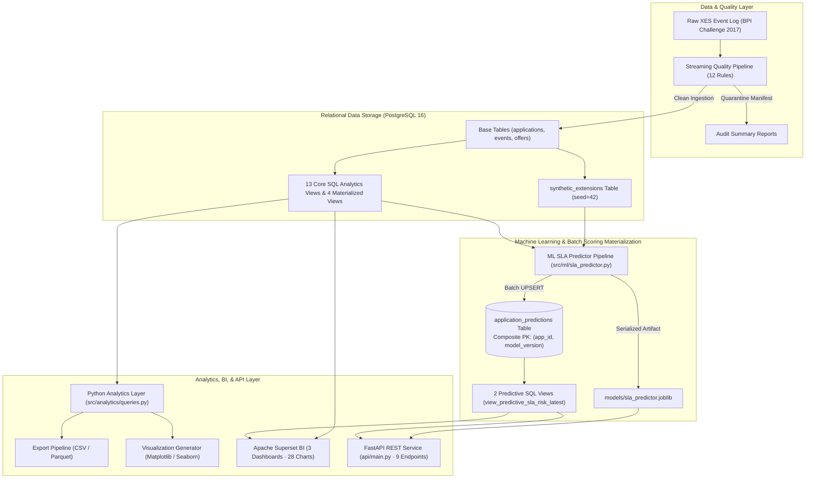
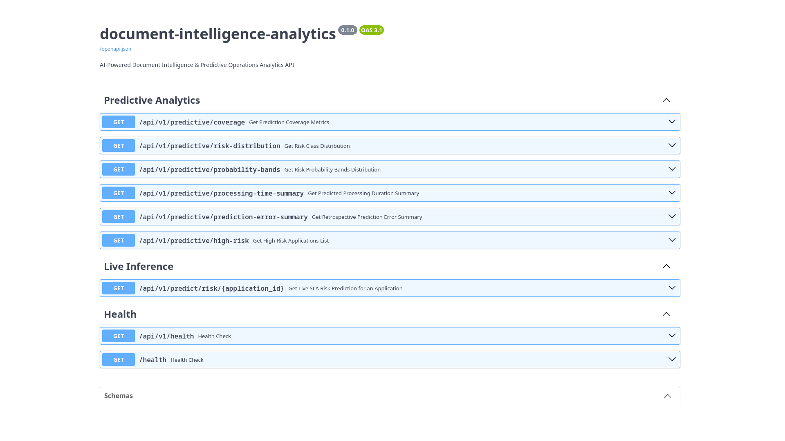
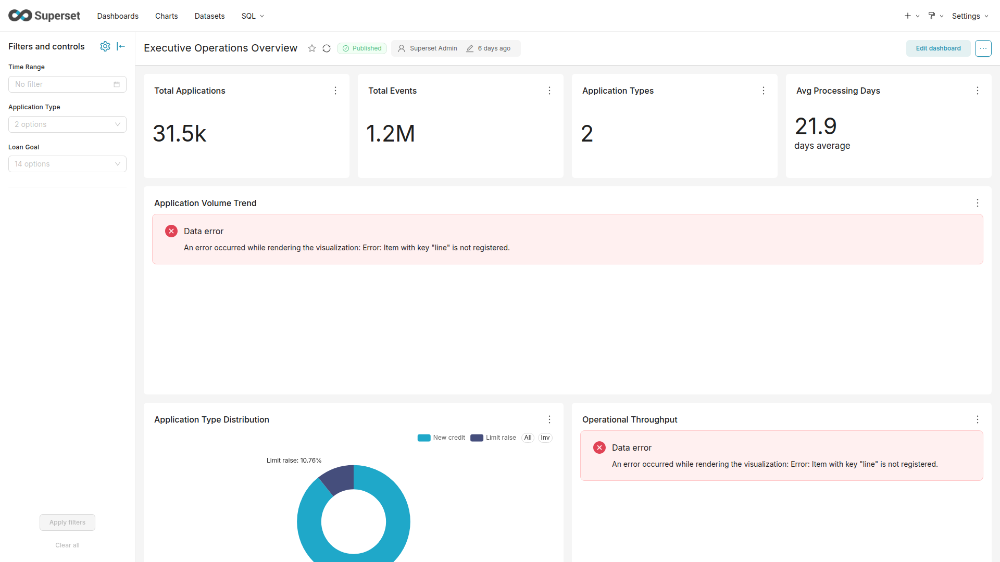
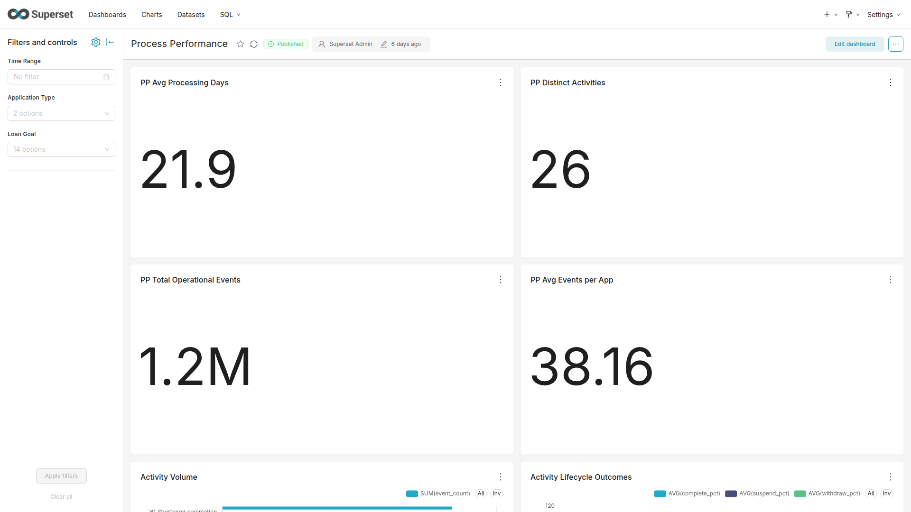

# Operations Analytics & Predictive Intelligence Pipeline — Loan Process Analysis

A **portfolio-grade process analytics and predictive intelligence platform** built around the real-world **BPI Challenge 2017** loan application event log (31,509 applications, 1,202,267 workflow events) augmented with seed-controlled synthetic operational metadata.

The pipeline ingests raw XML event logs, audits data quality with a non-destructive 12-rule parser, loads relational records into an indexed PostgreSQL 16 database, computes operational metrics via 13 core analytical views, 2 predictive views, and 4 materialized views, exports multi-format analytics, generates visualization charts, serves 3 published BI dashboards in Apache Superset, trains baseline machine learning models (`SLARiskPredictor`) for SLA breach risk and cycle-time prediction, and exposes live predictive inference via a 9-endpoint FastAPI REST service.

> **Status:** Implementation status: Phases 1–9.5D complete · **312 / 312 Pytest Tests Passing** (100% test suite pass rate).

---

## Overview

This project takes a real operational dataset — the [BPI Challenge 2017](https://data.4tu.nl/articles/dataset/BPI_Challenge_2017/12696884) loan application event log from a Dutch financial institution — and builds a complete analytics, machine learning, and API stack around it.

To evaluate process scenarios where organizational attributes (such as document types, page counts, branches, and operator teams) are missing from raw event logs, the platform incorporates a seed-controlled (`seed=42`) synthetic extension generator (`synthetic_extensions`).

The pipeline answers practical business questions about operational performance:
- How many applications are processed each month, and how does throughput fluctuate?
- Where do operational bottlenecks occur, and which workflow activities dominate?
- How long do applications take to complete across duration categories?
- Which resources handle the highest workload volume?
- Which incoming loan applications exhibit high risk of SLA breach or extended turnaround duration?

Each layer is independently testable, built on actual operational event data combined with documented synthetic extension metadata, and supported by a comprehensive test suite.

---

## Business Problem

Financial institutions process thousands of loan applications through multi-step workflows involving validation, offer generation, customer calls, and lifecycle management. Understanding operational performance — volume trends, processing times, resource utilization, outcome distributions, and turnaround risk — is essential for capacity planning and process optimization.

This project analyzes 13 months of loan application events (January 2016 – February 2017) to provide operational process intelligence, diagnostic SQL views, BI dashboards, and early-warning predictive signals for operations managers.

---

## Key Questions Answered

- How many loan applications are processed, and how many events occur per application?
- What is the distribution of application types (new credit vs. limit raise)?
- How does application volume change month-over-month?
- How long do applications take to process, and what is the typical duration bucket?
- Which workflow activities generate the most events?
- How is workload distributed across resources (staff/system actors)?
- What are the lifecycle outcomes (complete, suspend, withdraw, abort)?
- How do different loan purposes compare in volume and processing time?
- Which incoming applications are at risk of exceeding median processing turnaround times?

---

## Dataset & Synthetic Metadata Disclosures

### Real Event Log Data (BPI Challenge 2017)

| Attribute | Observed Value |
| :--- | :--- |
| **Source** | [BPI Challenge 2017](https://doi.org/10.4121/uuid:5f3067df-f10b-45da-b98b-86ae4c7a310b) (Eindhoven University of Technology / 4TU.ResearchData) |
| **Format** | XES event log (gzip-compressed XML) |
| **Time coverage** | January 2016 – February 2017 (13 months) |
| **Applications** | 31,509 unique loan application cases |
| **Events** | 1,202,267 workflow events |
| **Application types** | New credit (89.3%), Limit raise (10.7%) |
| **Activities** | 26 distinct workflow activities (`W_`, `O_`, `A_` prefixes) |
| **Resources** | 149 anonymized actors/systems |
| **License** | 4TU General Terms of Use |

The raw XES file is not committed to Git. Provenance metadata is tracked in [`data/source_manifest.json`](data/source_manifest.json), and a download script with checksum verification is provided.

### Synthetic Operational Metadata Disclosure

> [!IMPORTANT]
> **Synthetic Extensions Disclosure:** Attributes stored in table `synthetic_extensions` (`document_type`, `page_count`, `branch`, `operator_team`, `priority`, `region`, `channel`, `quality_score`, `sla_target_hours`) are **seed-controlled (`seed=42`) synthetic operational fields** generated deterministically to model operational context missing from raw BPI event logs.
> **They are NOT observed bank data.** They are strictly isolated in `synthetic_extensions` and explicitly tagged in audit lineage metadata as `synthetic`.

---

## Solution Architecture



---

## Technology Stack

| Category | Technologies |
| :--- | :--- |
| **Database** | PostgreSQL 16.15 (Native / Podman) |
| **SQL Engine** | 13 core analytics views, 2 predictive views, 4 materialized views, window functions, composite primary keys |
| **Python** | Python 3.12, `psycopg3`, SQLAlchemy 2.0, `pandas`, `numpy`, `scipy` |
| **Data Quality** | Streaming XES parser (`xml.etree.ElementTree`), 12-rule validation catalog |
| **Export Formats**| CSV (UTF-8), Parquet (PyArrow columnar compression) |
| **Visualization**| Matplotlib, Seaborn (non-interactive `Agg` backend) |
| **Business Intelligence** | Apache Superset 6.1.0 (Podman, FastMCP server connected) |
| **Machine Learning** | `scikit-learn` (`ColumnTransformer`, `HistGradientBoostingClassifier`, `HistGradientBoostingRegressor`) |
| **REST API** | FastAPI 0.110+, Uvicorn, Pydantic v2 schemas |
| **Configuration** | `pydantic-settings`, `python-dotenv`, Docker Compose |
| **Testing** | `pytest`, `pytest-cov` |

---

## Data Quality Pipeline

The quality pipeline (`src/cleaning/quality_pipeline.py`) uses a non-destructive, streaming approach — reading compressed XES event logs via `iterparse` without loading the full 1.2M events into memory.

**12 validation rules** cover:
- **Identity**: Missing trace/event IDs, duplicate IDs.
- **Timestamps**: Null timestamps, non-monotonic sequences, impossible durations.
- **Content**: Missing activities.
- **Scope**: Orphaned events, synthetic field presence.
- **Aggregation**: Trace counts, event counts, bounded rule examples.

**Verified Quality Results (BPI Challenge 2017 Dataset):**
- 31,509 traces checked
- 1,202,267 events checked
- 0 quarantine candidates
- 0 error or warning rule violations

Quarantine manifests report issues without deleting or mutating records.

---

## Database & SQL Analytics

### Base Schema (7 Tables)

| Table | Primary Key | Purpose |
| :--- | :--- | :--- |
| `applications` | `application_id` | One row per loan application (31,509 rows) |
| `events` | `event_id` | One row per workflow event (1,202,267 rows, FK to `applications`) |
| `offers` | `offer_id` | Validated offer records per application |
| `synthetic_extensions` | `application_id` | Seed-controlled operational extension fields (31,509 rows) |
| `application_predictions`| `(application_id, model_version)` | Composite PK table persisting batch ML model predictions (31,509 rows) |
| `data_loads` | `load_id` | Import lineage and audit logging |
| `schema_versions` | `version` | Migration version history (`001`, `002`, `003`) |

### SQL Analytics Views (13 Core Views + 2 Predictive Views + 4 Materialized Views)

| View Name | Type | Analytical Purpose |
| :--- | :--- | :--- |
| `view_application_metrics` | Core View | Per-application processing duration, event counts, lifecycle counts |
| `view_daily_throughput` | Core View | Daily application and event volume |
| `view_activity_summary` | Core View | Activity frequency, type classification, lifecycle percentages |
| `view_resource_workload` | Core View | Resource utilization and workload distribution |
| `view_application_type_metrics` | Core View | Metrics grouped by application type |
| `view_loan_goal_metrics` | Core View | Metrics grouped by loan purpose |
| `view_lifecycle_transition_metrics` | Core View | Outcome distribution (complete/suspend/withdraw/abort) |
| `view_event_origin_metrics` | Core View | Event origin analysis |
| `view_monthly_summary` | Core View | Monthly aggregated volume and performance |
| `view_weekly_summary` | Core View | Weekly aggregated volume |
| `view_event_sequence` | Core View | Event sequence with window functions (`LEAD`/`LAG`) |
| `view_processing_time_buckets` | Core View | Applications by duration category |
| `view_offer_analysis` | Core View | Offer lifecycle metrics |
| `view_predictive_sla_risk` | Predictive View | Historical predictive view preserving multi-version model predictions |
| `view_predictive_sla_risk_latest` | Predictive View | Operational predictive view at single-row per application grain |
| `mv_activity_summary` | Materialized View | Pre-computed activity aggregation |
| `mv_resource_workload` | Materialized View | Pre-computed resource utilization |
| `mv_monthly_summary` | Materialized View | Pre-computed monthly trends |
| `mv_application_type_summary` | Materialized View | Pre-computed application type metrics |

---

## Machine Learning & Predictive SLA Risk Pipeline (Phase 8 & 9)

### Baseline Operational Model Architecture (`SLARiskPredictor`)

The predictive engine (`src/ml/sla_predictor.py`) implements an **experimental operational early-warning baseline model** designed to identify incoming applications at risk of exceeding median turnaround duration.

> [!NOTE]
> **Not a Credit Scoring Model:** This model predicts workflow cycle-time risk and operational turnaround duration for SLA capacity planning. It does NOT evaluate credit risk, creditworthiness, or financial underwriting eligibility.

### Feature Leakage Guardrails
- **At-Start Feature Extraction (`get_application_features_for_inference`)**: Model features are extracted strictly at application submission ($t_0$).
- **Excluded Features**: Downstream event counts, activity durations, and lifecycle event names occurring after application submission are strictly excluded to prevent target leakage.
- **At-Start Feature Set**: 6 real source predictors (`requested_amount`, `application_type`, `loan_goal`, `submission_hour`, `submission_day_of_week`, `submission_month`).

### Empirical Evaluation Metrics

Evaluated via 5-fold cross-validation and 20% holdout test set (6,302 cases, fixed seed `42`):

| Evaluation Metric | Dummy Baseline | Model A: Real-Only Features (6 Predictors) | Model B: Full Features (15 Predictors) |
| :--- | :--- | :--- | :--- |
| **Holdout ROC-AUC** (20% Test) | 0.5000 | **0.5840** | **0.5878** |
| **Holdout PR-AUC** (20% Test) | 0.5000 | **0.5746** | **0.5768** |
| **Holdout F1-Score** | 0.5000 | **0.5748** | **0.5760** |
| **Holdout Precision** | 0.5000 | **0.5820** | **0.5840** |
| **Holdout MAE (Days)** | 15.3400 days | **10.3802 days** | **10.3854 days** |
| **Holdout RMSE (Days)** | 22.6133 days | **13.7220 days** | **13.7383 days** |

### Model Performance Analysis & Limitations
- **Classification Signal**: At application submission ($t_0$), initial case attributes (`requested_amount`, `application_type`, `loan_goal`) provide modest predictive discrimination (ROC-AUC 0.5840 vs Dummy 0.5000), reflecting that much of loan processing duration is driven by downstream customer response times and manual verification steps.
- **Regression Accuracy**: In holdout evaluation, the regressor achieved a Mean Absolute Error of **10.38 days** compared to **15.34 days** for the dummy median baseline (and RMSE of 13.72 days vs 22.61 days for the dummy baseline).
- **Synthetic Noise**: Feature ablation proved that adding synthetic extension fields improves classification ROC-AUC by only $+0.0038$, confirming that synthetic fields act primarily as statistical noise relative to actual duration.

---

## FastAPI REST Service & Live Inference (Phase 9.5)

The REST API service (`api/main.py`) exposes **9 GET endpoints** for predictive analytics summaries and live single-application SLA risk inference.

| Endpoint Path | Response Schema | Purpose |
| :--- | :--- | :--- |
| `/health` | `HealthResponse` | Root health check (handles DB status gracefully) |
| `/api/v1/health` | `HealthResponse` | Versioned health check endpoint |
| `/api/v1/predict/risk/{application_id}` | `LiveInferenceResponse` | Live SLA risk classification & cycle-time inference using trained model |
| `/api/v1/predictive/coverage` | `PredictionCoverageResponse` | Total vs. scored application coverage |
| `/api/v1/predictive/risk-distribution` | `RiskDistributionResponse` | Binned high-risk vs. low-risk distribution counts |
| `/api/v1/predictive/probability-bands` | `RiskProbabilityBandsResponse` | Binned probability band counts (0.0–0.2 to 0.8–1.0) |
| `/api/v1/predictive/processing-time-summary` | `PredictedProcessingTimeSummaryResponse` | Predicted processing duration summary (mean, median, min, max) |
| `/api/v1/predictive/prediction-error-summary` | `PredictionErrorSummaryResponse` | Retrospective prediction error metrics (MAE, RMSE, mean error) |
| `/api/v1/predictive/high-risk` | `HighRiskApplicationsResponse` | Configurable high-risk application queue sorted deterministically |

### Interactive OpenAPI Documentation
When the service is running, interactive OpenAPI Swagger documentation is available at `http://localhost:8000/docs`.



---

## Apache Superset BI Integration (Phase 7 & 9.4)

Published interactive BI dashboards in Apache Superset 6.1.0 running on `http://localhost:8088`:

1. **Dashboard ID 1: Executive Operations & Predictive SLA Risk** (9 charts, 3 native filters) — `http://localhost:8088/superset/dashboard/1/`

   

2. **Dashboard ID 2: Process Performance Analytics** (11 charts, 3 native filters) — `http://localhost:8088/superset/dashboard/2/`

   

3. **Dashboard ID 3: Resource & Workload Distribution** (8 charts, 1 native filter) — `http://localhost:8088/superset/dashboard/3/`

   

All 28 charts execute cleanly against registered PostgreSQL datasets without SQL errors.

---

## Python Analytics, Exports, & Visualizations

### Typed Python Query Layer (`src/analytics/queries.py` & `predictive_analytics.py`)
Provides **20 typed query functions** (14 operational query functions + 6 predictive query functions) consuming SQL views without SQL duplication.

### Analytics Export (`src/analytics/export.py`)
Generates 8 analytical datasets in CSV (UTF-8) and Parquet (PyArrow columnar compression) formats under `reports/generated/analytics/` with metadata manifests.

### Visualizations (`src/analytics/visualization.py`)
Generates 8 static chart types (KPI stat tiles, bar, line, donut, grouped bar) using Matplotlib and Seaborn under `reports/generated/plots/`.

---

## Key Analytical Insights

- **Activity Concentration**: The top 3 activities (`W_Validate application`, `W_Call after offers`, `W_Call incomplete files`) account for nearly 50% of all 1.2M workflow events.
- **Duration Bucket Distribution**: Over 92% of applications take more than 24 hours to process, with 57.9% taking 1–4 weeks and 35.0% taking >4 weeks.
- **Workload Concentration**: Operational workload is concentrated, with top individual resources handling a significant share of total events.
- **Application Type Breakdown**: New credit applications dominate (89.3%), requiring higher average event counts (38.5 events/app) than Limit raise applications (35.0 events/app).

---

## Testing & Quality Assurance

```bash
.venv/bin/pytest tests/ -v
======================== 312 passed in 414.56s ========================
```

**312 / 312 tests passing — 100% test suite success rate.**

| Subsystem / Layer | Test Module | Test Count | Scope & Verification |
| :--- | :--- | :--- | :--- |
| **Data Quality Pipeline** | `test_quality_pipeline.py` | 1 | 12-rule streaming parser, quarantine manifests |
| **Database Schema** | `test_database.py` | 17 | Connection management, migrations, table constraints |
| **SQL Analytics Views** | `test_sql_analytics.py` | 33 | 13 analytical views, 4 materialized views, refresh logic |
| **Python Analytics Query** | `test_analytics_queries.py` | 50 | 14 typed query functions, type consistency |
| **Analytics Export** | `test_analytics_export.py` | 55 | CSV/Parquet batch export, metadata manifests |
| **Analytics Visualization**| `test_analytics_visualization.py` | 58 | 8 Matplotlib chart functions, batch PNG generation |
| **Synthetic Metadata** | `test_synthetic_generator.py` | 16 | Seed-controlled determinism (`seed=42`), schema rules |
| **Synthetic Population** | `test_populate_synthetic_extensions.py` | 11 | Batch population idempotency, audit load logging |
| **ML Predictive Pipeline** | `test_ml_pipeline.py` | 6 | SLA risk classifier, duration regressor, joblib artifacts |
| **Predictive SQL Views** | `test_predictive_views.py` | 11 | `application_predictions` table, dual-grain views |
| **Predictive Queries** | `test_predictive_queries.py` | 4 | At-start feature extraction, batch inference |
| **Predictive Analytics** | `test_predictive_analytics.py` | 17 | 6 predictive query functions, filters, error summaries |
| **FastAPI Foundation** | `test_api_foundation.py` | 12 | App metadata, health checks, CORS, Pydantic validation |
| **FastAPI Predictive API** | `test_api_predictive.py` | 11 | 6 predictive analytics GET endpoints, error scenarios |
| **FastAPI Live Inference** | `test_api_inference.py` | 6 | Live inference endpoint, HTTP 404/422/500 handling |

---

## Project Structure

```text
document-intelligence-analytics/
├── api/
│   ├── __init__.py
│   ├── main.py                     # FastAPI application & health routes
│   ├── schemas.py                  # Pydantic v2 response models
│   └── routes/
│       ├── __init__.py
│       ├── predictive.py           # 6 predictive summary endpoints
│       └── inference.py            # Live single-application risk endpoint
├── data/
│   ├── raw/                        # Raw XES file (Git-ignored)
│   └── source_manifest.json        # Dataset provenance and MD5 checksum
├── docs/
│   ├── architecture.md             # Architecture specification
│   ├── PHASE_1_TO_8_COMPLETE_LEARNING_GUIDE.md  # Master guide (Phases 1–8)
│   ├── PHASE_9_COMPLETE_LEARNING_GUIDE.md       # Master guide (Phase 9)
│   └── phase_8_*.md                # ML evaluation & ablation reports
├── models/
│   └── sla_predictor.joblib        # Serialized ML model artifact (Git-ignored)
├── notebooks/
│   ├── 01_analytics_walkthrough.ipynb # Interactive analytics notebook
│   └── create_nb.py                # Notebook generator script
├── reports/
│   └── generated/                  # Exported datasets, plots, and quality reports
├── scripts/
│   ├── download_bpi_2017.ps1       # Dataset downloader with checksum
│   ├── init_database.py            # Initialize PostgreSQL schema
│   ├── load_xes_to_db.py           # Load XES data into PostgreSQL
│   ├── refresh_views.py            # Refresh materialized views
│   ├── populate_synthetic_extensions.py # Populate synthetic extensions
│   └── populate_predictive_scores.py   # Materialize ML batch scores
├── sql/
│   ├── 001_create_schema.sql       # Database migration: base tables
│   ├── 002_analytics_views.sql     # Migration: 13 views + 4 materialized views
│   └── 003_predictive_views.sql     # Migration: predictions table & dual views
├── src/
│   ├── config.py                   # pydantic-settings configuration
│   ├── database.py                 # Connection management & migrations
│   ├── cleaning/
│   │   ├── quality_pipeline.py     # Non-destructive XES quality checks
│   │   └── synthetic_generator.py  # Seed-controlled synthetic generator
│   ├── ml/
│   │   ├── feature_engineering.py  # At-start feature extraction matrix
│   │   └── sla_predictor.py        # ML SLA risk predictor model
│   └── analytics/
│       ├── queries.py              # 14 typed query functions
│       ├── predictive_analytics.py # 6 predictive summary functions
│       ├── predictive_queries.py   # Inference feature queries
│       ├── export.py               # CSV/Parquet export module
│       └── visualization.py        # Matplotlib/Seaborn chart generation
├── tests/                          # 12 test modules (312 tests passing)
├── pyproject.toml                  # Dependencies & pytest options
├── docker-compose.yml              # PostgreSQL 16 container definition
└── .gitignore                      # Ignore rules
```

---

## Getting Started & Operational Execution Guide

### 1. Prerequisites
- Python 3.11 or newer
- PostgreSQL 16 (or Podman / Docker Compose)
- PowerShell (for dataset download script)

### 2. Environment Setup
```bash
git clone https://github.com/<your-username>/document-intelligence-analytics.git
cd document-intelligence-analytics

python -m venv .venv
source .venv/bin/activate        # Linux/macOS
# .venv\Scripts\activate          # Windows

pip install -e ".[dev]"
```

### 3. Dataset Download & Verification
```bash
# Cross-Platform Python Downloader
python scripts/download_bpi_2017.py

# Windows PowerShell Alternative
.\scripts\download_bpi_2017.ps1
```
Downloads `BPI_Challenge_2017.xes.gz` to `data/raw/` and verifies MD5 checksum.

### 4. Database Initialization & Data Loading
```bash
# Start PostgreSQL via Docker Compose
docker compose up -d postgres

# Initialize schema, load XES event log, and build analytics views
python scripts/init_database.py
python scripts/load_xes_to_db.py
psql -U document_app -d document_intelligence -f sql/002_analytics_views.sql
python scripts/refresh_views.py
```

### 5. Synthetic Metadata & Batch ML Scoring Materialization
```bash
# Populate synthetic extensions table (31,509 cases, seed=42)
python scripts/populate_synthetic_extensions.py

# Apply predictive SQL schema migration
psql -U document_app -d document_intelligence -f sql/003_predictive_views.sql

# Run batch ML prediction materialization script
python scripts/populate_predictive_scores.py --model-version v1.0
```

### 6. Launch FastAPI REST Service
```bash
uv run uvicorn api.main:app --reload --port 8000
```
- API Health Check: `http://localhost:8000/health`
- Interactive OpenAPI Swagger Documentation: `http://localhost:8000/docs`
- Live Inference Endpoint: `http://localhost:8000/api/v1/predict/risk/Application_1`

### 7. Run Test Suite
```bash
.venv/bin/pytest tests/ -v
```

---

## Project Limitations & Interview Disclosure Notes

1. **Synthetic Operational Fields**: Attributes in `synthetic_extensions` (`priority`, `quality_score`, `branch`, `operator_team`) are seed-controlled (`seed=42`) synthetic operational fields to model multi-channel loan attributes missing from raw event logs. They are **not** observed bank data.
2. **At-Start Feature Guardrails**: Risk predictions use only initial case attributes known at submission ($t_0$) to prevent target leakage. Downstream event counts or activity durations are strictly excluded from inference features.
3. **Operational Early Warning Scope**: The machine learning model (`SLARiskPredictor`) is a baseline experimental model for operational capacity planning and SLA early warning. It does **not** evaluate credit risk or loan underwriting decisions.
4. **Local Execution**: BI dashboards require a local Apache Superset instance connected to PostgreSQL, and REST API endpoints require running the Uvicorn server locally.

---

## Documentation Index & Learning Guides

For detailed technical walk-throughs, architectural deep-dives, and interview Q&A guides, refer to:
- [`docs/PHASE_1_TO_8_COMPLETE_LEARNING_GUIDE.md`](docs/PHASE_1_TO_8_COMPLETE_LEARNING_GUIDE.md) — Master guide covering data engineering, PostgreSQL schemas, SQL views, Superset BI setup, and ML pipeline design.
- [`docs/PHASE_9_COMPLETE_LEARNING_GUIDE.md`](docs/PHASE_9_COMPLETE_LEARNING_GUIDE.md) — Master guide covering batch prediction materialization, dual predictive views, FastAPI REST API reference, and capstone interview defense notes.
- [`docs/architecture.md`](docs/architecture.md) — Full technical architecture specification.
- [`docs/phase_8_2c_model_evaluation_audit.md`](docs/phase_8_2c_model_evaluation_audit.md) — Detailed ML evaluation metrics and baseline comparisons.

---

## Skills Demonstrated

- **Data Quality Engineering**: Non-destructive streaming XML parsing (`iterparse`), 12-rule validation catalog, quarantine manifests.
- **Database Engineering**: PostgreSQL 16 schema design, index optimization, composite primary keys, migration tracking.
- **Advanced SQL Analytics**: 13 core analytics views, 2 predictive views, 4 materialized views, window functions (`LEAD`/`LAG`), time-bucket aggregations.
- **Python Analytics & Export**: Typed query interfaces, automated CSV/Parquet columnar exports, Matplotlib/Seaborn visualization.
- **Business Intelligence**: Apache Superset dashboard publishing, dataset registrations, FastMCP server integration.
- **Machine Learning & Feature Engineering**: Scikit-learn pipelines, at-start feature extraction matrices, target leakage prevention, cross-validation, feature ablation.
- **REST API Development**: FastAPI, Pydantic v2 validation schemas, OpenAPI documentation, live single-case inference.
- **Software Testing**: Pytest test suite engineering (**312 tests passing**, 100% success rate).

---

## Conclusion

This project demonstrates a complete data analytics, machine learning, and API platform — from raw event log ingestion through relational database design, SQL analytics, Python querying, BI dashboarding, ML SLA risk modeling, and REST API delivery. Built on real operational data with complete test coverage, it demonstrates the practical capabilities required to convert raw workflow logs into structured operational insights and predictive signals.
