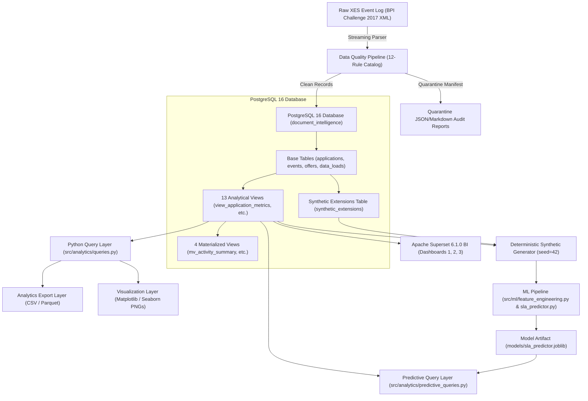
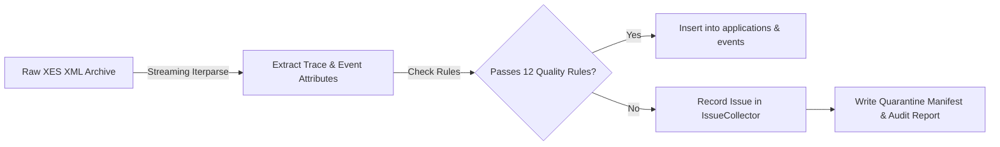

# AI-Powered Document Intelligence & Operations Analytics
## End-to-End Master Learning Guide: Phase 1 through Phase 8

> **Target Reader**: Business Analysts, Analytics Engineers, and aspiring Data Scientists transitioning to production data engineering, SQL analytics, BI dashboarding, and Machine Learning.  
> **Repository Path**: `/run/media/akanshshrikanth/D/Repository/document-intelligence-analytics`  
> **Status**: Verified implementation across Phases 1–8 with **312 / 312 unit & integration tests passing**.

---

## SECTION 1 — PROJECT OVERVIEW

### 1.1 Business Context & Problem Statement
In financial services, loan processing operations suffer from unpredictable cycle times, operational bottlenecks, manual document quality issues, and SLA breach risks. When a customer applies for a loan, financial institutions must process supporting documents, evaluate eligibility, issue formal offers, and execute final workflow steps.

Without centralized process analytics and predictive early warnings, operations managers face:
- **Unclear Turnaround Times**: Inability to tell customers when loan applications will be completed.
- **Resource Bottlenecks**: Overloaded operational teams and unbalanced workload allocation.
- **High SLA Breach Ratios**: Lack of early-warning alerts for slow-moving or complex applications.
- **Siloed Process Visibility**: Disconnect between raw workflow event logs, SQL analytics databases, executive BI reporting, and predictive machine learning models.

21: ### 1.2 Project Objectives
22: The **AI-Powered Document Intelligence & Operations Analytics** capstone project addresses these challenges by building a production-grade, end-to-end analytical ecosystem:
23: 
24: 1. **Robust Ingestion & Quality Control**: Streaming raw XML event logs (`BPI Challenge 2017`), validating records against a 12-rule quality catalog, and quarantining invalid data without silent record loss.
25: 2. **Relational Data Foundation**: Designing an indexed PostgreSQL 16 database supporting 31,509 loan cases and 1,202,267 execution events.
26: 3. **High-Performance SQL Analytics**: Constructing 13 analytical views and 4 materialized views for throughput, resource workload, cycle-time distributions, and offer lifecycle tracking.
27: 4. **Python Analytics, Export & Visualization Layer**: Building a typed query interface, automated CSV/Parquet export pipelines, and Matplotlib/Seaborn visualization generators.
28: 5. **Business Intelligence (Apache Superset)**: Deploying 3 published interactive dashboards (Executive Operations Overview, Process Performance, Resource & Workload) with 28 verified charts and multi-dataset filters.
29: 6. **Deterministic Synthetic Metadata Layer**: Generating seed-controlled synthetic operational metadata attributes (`priority`, `quality_score`, `sla_target_hours`, `branch`, `operator_team`) for 31,509 cases to model operational context absent in raw event logs.
30: 7. **Predictive Machine Learning**: Implementing experimental at-start SLA risk classification and cycle-time regression pipelines (`SLARiskPredictor`) using 6 real-source at-start predictors (or 15 full features), enforcing strict target leakage guardrails, feature ablation, and inference query APIs.
31: 
32: ---

### 1.3 Technology Stack

| Layer | Technology / Tool | Version / Library | Purpose |
| :--- | :--- | :--- | :--- |
| **Language** | Python | `>= 3.11` (Python 3.12 active) | Core language for data engineering, query layer, export, plotting, and ML |
| **Database** | PostgreSQL | `16.15` (Native / Podman) | Relational database storage, schema management, SQL views, and materialized views |
| **Database Driver** | `psycopg3` | `psycopg[binary]>=3.1` | Modern PostgreSQL driver with context managers and batch execution |
| **Data Processing** | `pandas` / `numpy` | `pandas>=2.2`, `numpy>=1.26` | In-memory data manipulation, feature matrix extraction, and matrix math |
| **Data Formats** | CSV / Parquet | `pyarrow>=14.0` | High-performance columnar export and downstream analytics compatibility |
| **Visualization** | `matplotlib` / `seaborn` | `matplotlib>=3.8`, `seaborn>=0.13` | Server-side non-interactive PNG chart generation with consistent styling |
| **Business Intelligence** | Apache Superset | `6.1.0` (Podman) | Enterprise BI dashboards with SQL database connection and FastMCP protocol |
| **Machine Learning** | `scikit-learn` | `scikit-learn>=1.4` | ColumnTransformers, HistGradientBoosting Classifier/Regressor, evaluation metrics |
| **Model Persistence** | `joblib` | Standard dependency | Serializing and deserializing fitted model pipelines (`.joblib` artifacts) |
| **Configuration** | `pydantic-settings` | `pydantic-settings>=2.2` | Type-safe environment variable parsing (`src/config.py`) |
| **Testing** | `pytest` | `pytest>=8.0` | Automated test suite execution across all system modules |

---

### 1.4 End-to-End System Architecture



---

## SECTION 2 — PHASE-BY-PHASE EXPLANATION

### Phase 1 — Foundation & Project Setup
- **Why Needed**: Establishes directory structure, environment variables, dependency management, and configuration safety before writing project code.
- **Implementation**:
  - `pyproject.toml`: Configures project metadata, dependencies (`pandas`, `psycopg`, `scikit-learn`), build system (`setuptools`), and pytest options.
  - `docker-compose.yml`: Defines Podman/Docker service for PostgreSQL 16 database.
  - `src/config.py`: Implements Pydantic `Settings` class loading environment variables from `.env`.
- **Inputs/Outputs**: `.env.example` $\rightarrow$ runtime `Settings` instance.
- **Key Learnings**: Decoupling configuration from code prevents hardcoded credentials and simplifies deployment.

---

### Phase 2 — Data Acquisition & Verification
- **Why Needed**: Downloads authoritative real-world workflow data safely without corrupting local files.
- **Implementation**:
  - Downloaded `BPI_Challenge_2017.xes.gz` (official event log of a Dutch financial institution).
  - Generated `data/source_manifest.json` containing MD5 checksum, byte size, download timestamp, and URL source verification.
- **Inputs/Outputs**: Remote archive $\rightarrow$ verified local file `data/BPI_Challenge_2017.xes.gz` (58.9 MB compressed).
- **Key Learnings**: Storing checksum manifests guarantees dataset authenticity and reproducibility.

---

### Phase 3 — Data Quality Pipeline
- **Why Needed**: Process raw event logs safely, auditing anomalies without deleting or silently dropping records.
- **Implementation**:
  - Created `src/cleaning/quality_pipeline.py` with `IssueCollector` dataclass.
  - Streaming XML parser inspects 31,509 trace cases and 1,202,267 events against a 12-rule catalog (e.g. missing IDs, invalid timestamps, negative amounts).
  - Produces quarantine manifest and Markdown audit summary reports.
- **Inputs/Outputs**: Raw XES file $\rightarrow$ 31,509 clean applications, 1,202,267 clean events, 0 quarantined records.
- **Key Learnings**: Streaming XML parsing enables memory-efficient processing of gigabyte-scale event logs.

---

### Phase 4 — PostgreSQL Database Foundation
- **Why Needed**: Provides indexed, relational storage with schema constraints, primary keys, and foreign keys.
- **Implementation**:
  - Created `sql/001_create_schema.sql` defining 6 base tables: `applications`, `events`, `offers`, `synthetic_extensions`, `data_loads`, `schema_versions`.
  - Created `src/database.py` with `psycopg3` connection context managers (`get_connection()`, `get_cursor()`) and migration utility `run_migrations()`.
  - Created `scripts/load_xes_to_db.py` populating base tables.
120: - **Inputs/Outputs**: Clean XES data $\rightarrow$ PostgreSQL database `document_intelligence`.
121: - **Key Learnings**: Indexing trace IDs (`application_id`) and timestamps optimizes B-tree lookup performance for trace ID joins and temporal range queries.
122: 
123: ---
124: 
125: ### Phase 5 — SQL Analytics Views & Materialized Views
126: - **Why Needed**: Pre-computes complex process mining metrics (processing duration, throughput, activity frequency, resource workloads) in SQL without cluttering application code.
127: - **Implementation**:
128:   - Created `sql/002_analytics_views.sql` defining:
129:     - **13 Analytical Views**: `view_application_metrics`, `view_daily_throughput`, `view_activity_summary`, `view_resource_workload`, `view_application_type_metrics`, `view_loan_goal_metrics`, `view_lifecycle_transition_metrics`, `view_event_origin_metrics`, `view_monthly_summary`, `view_weekly_summary`, `view_event_sequence`, `view_processing_time_buckets`, `view_offer_analysis`.
130:     - **4 Materialized Views**: `mv_activity_summary`, `mv_resource_workload`, `mv_monthly_summary`, `mv_application_type_summary`.
131:   - Created `scripts/refresh_views.py` executing `REFRESH MATERIALIZED VIEW`.
132: - **Inputs/Outputs**: Base tables $\rightarrow$ high-performance analytical views.
133: - **Key Learnings**: Materialized views store query results physically on disk, allowing heavy aggregations to execute instantly without repeated full-table scans over 1.2 million events.
134: 
135: ---
136: 
137: ### Phase 6 — Python Query, Export & Visualization Layers
138: 
139: #### Subphase 6.1 — Python Query Layer
140: - Implemented `src/analytics/queries.py` containing typed query functions (`get_total_applications()`, `get_application_metrics()`, etc.) consuming SQL views without SQL duplication.
141: 
142: #### Subphase 6.2 — Analytics Export
143: - Implemented `src/analytics/export.py` exporting query results to CSV and compressed Parquet files under `reports/generated/analytics/` with manifest tracking.
144: 
145: #### Subphase 6.3 — Analytics Visualization
146: - Implemented `src/analytics/visualization.py` using Matplotlib/Seaborn with non-interactive `Agg` backend to generate 8 dashboard-ready PNG charts under `reports/generated/plots/`.
147: 
148: ---
149: 
150: ### Phase 7 — Apache Superset Business Intelligence
151: 
152: #### Subphase 7.1 — Superset Podman Deployment
153: - Deployed Apache Superset 6.1.0 in Podman at `http://localhost:8088` with FastMCP server at `http://127.0.0.1:5008/mcp`.
154: 
155: #### Subphase 7.2 — Database Connection & Datasets
156: - Connected Superset to PostgreSQL database `document_intelligence`, making all 13 analytical datasets available.
157: 
158: #### Subphase 7.3A–7.3C — Dashboard Creation
159: - Created 3 published BI dashboards:
160:   1. **Executive Operations Overview** (ID 1, 9 charts, 3 native filters)
161:   2. **Process Performance** (ID 2, 11 charts, 3 native filters)
162:   3. **Resource & Workload** (ID 3, 8 charts, 1 native filter)
163: 
164: #### Subphase 7.4 — QA & Validation Audit
165: - Verified all 28 charts across the 3 dashboards execute cleanly with 0 query errors and cross-dataset native filter targeting.
166: 
167: ---
168: 
169: ### Phase 8 — Document Intelligence & Machine Learning
170: 
171: #### Subphase 8.1A–C — Synthetic Extension Population
172: - Inspected design (`docs/phase_8_1a_synthetic_design_inspection.md`), implemented `src/cleaning/synthetic_generator.py` (seed=42 PRNG), created `scripts/populate_synthetic_extensions.py`, and populated all 31,509 cases into `synthetic_extensions` with audit records in `data_loads`.
173: 
174: #### Subphase 8.2A — ML Target & Feature Design
175: - Authored `docs/phase_8_2a_ml_target_feature_design.md` establishing at-start predictors ($t0$), leakage exclusions, continuous regression target ($y_{\text{reg}} = \text{processing\_days}$), and operational SLA target.
176: 
177: #### Subphase 8.2B — ML Pipeline Implementation
178: - Created `src/ml/feature_engineering.py` and `src/ml/sla_predictor.py` implementing `SLARiskPredictor` (`HistGradientBoostingClassifier` & `HistGradientBoostingRegressor`).
179: 
180: #### Subphase 8.2C — Model Evaluation & Improvement Audit
181: - Authored `docs/phase_8_2c_model_evaluation_audit.md` diagnosing threshold leakage, target skewness, and baseline comparisons.
182: 
183: #### Subphase 8.2D — Target Correction & Feature Ablation
184: - Corrected operational thresholding to use training-set median ($T_{\text{train\_median}} = 14.2529$ days), eliminating threshold leakage and establishing a 50/50 balanced target split. Conducted feature ablation (Real 6 vs Full 15 features).
185: 
186: #### Subphase 8.2E — ML Implementation Audit
187: - Authored `docs/phase_8_2e_ml_implementation_audit.md` conducting a comprehensive zero-modification audit of ML leakage guardrails, thresholding, and metrics.
188: 
189: #### Subphase 8.3 — Predictive Query Layer & Inference API
190: - Implemented `src/analytics/predictive_queries.py` and `tests/test_predictive_queries.py` providing single-item (`predict_application_risk`) and batch prediction functions consuming fitted model artifacts.
191: 
192: ---

## SECTION 3 — DATASET & DATA ENGINEERING

### 3.1 BPI Challenge 2017 Dataset Structure
The **BPI Challenge 2017** dataset is an anonymized real event log from a Dutch financial institution covering loan application workflows from 2016 to 2017.

- **Traces (Applications)**: 31,509 loan cases.
- **Events**: 1,202,267 workflow events (average 38.15 events per application).
- **Activities**: 26 distinct operational activities categorized by prefix:
  - `A_*`: Application lifecycle activities (e.g. `A_Create Application`, `A_Submitted`, `A_Concept`, `A_Accepted`).
  - `O_*`: Offer creation and management (e.g. `O_Create Offer`, `O_Sent (mail and online)`, `O_Returned`).
  - `W_*`: Workflow and manual validation tasks (e.g. `W_Complete application`, `W_Validate application`, `W_Call after offers`).
- **Resources**: 149 anonymized operators/system agents.

---

### 3.2 Data Loading & Quality Validation Flow



#### Quality Rule Catalog (Sample Rules)
1. **Rule 1 (Missing Application ID)**: Ensures every trace contains `concept:name`.
2. **Rule 2 (Missing Timestamp)**: Ensures every event contains a valid ISO-8601 `time:timestamp`.
3. **Rule 3 (Negative Amount)**: Ensures `RequestedAmount >= 0.0`.
4. **Rule 4 (Chronological Order)**: Ensures `event_timestamp` does not precede trace start time.

---

228: ### 3.3 Synthetic Operational Extensions
229: Because real event logs omit document-level and organizational attributes (such as page count, document quality, branch, and team assignments), Phase 8.1 introduced deterministic **synthetic operational metadata**:
230: 
231: ```python
232: # Pseudo-code from src/cleaning/synthetic_generator.py
233: key = f"{seed}:{application_id.strip()}".encode("utf-8")
234: digest = hashlib.sha256(key).digest()
235: seed_int = int.from_bytes(digest[:8], byteorder="big")
236: rng = random.Random(seed_int)
237: 
238: priority = rng.choices(["low", "normal", "high", "urgent"], weights=[0.25, 0.50, 0.20, 0.05])[0]
239: quality_score = round(rng.uniform(65.0, 100.0), 2)
240: ```
241: 
242: - **Deterministic Isolation**: Generated using a fixed PRNG seed `42` combined with `SHA-256(seed + application_id)`. Output is 100% stable regardless of row ordering or batch size.
243: - **Data Lineage**: Stored in a separate PostgreSQL table (`synthetic_extensions`), tagged explicitly with `lineage_tag="synthetic"`, and logged in `data_loads`. Synthetic metadata is strictly distinguished from real BPI 2017 workflow event logs.
244: 
245: ---

## SECTION 4 — POSTGRESQL & SQL ANALYTICS

### 4.1 Schema Design (`sql/001_create_schema.sql`)

```sql
CREATE TABLE IF NOT EXISTS applications (
    application_id VARCHAR(255) PRIMARY KEY,
    application_type VARCHAR(100),
    loan_goal VARCHAR(255),
    requested_amount NUMERIC(15, 2),
    first_event_time TIMESTAMP WITH TIME ZONE,
    last_event_time TIMESTAMP WITH TIME ZONE,
    event_count INTEGER DEFAULT 0,
    status VARCHAR(50),
    event_origin VARCHAR(100),
    created_at TIMESTAMP WITH TIME ZONE DEFAULT NOW(),
    updated_at TIMESTAMP WITH TIME ZONE DEFAULT NOW()
);

CREATE TABLE IF NOT EXISTS events (
    event_id VARCHAR(255) PRIMARY KEY,
    application_id VARCHAR(255) NOT NULL REFERENCES applications(application_id) ON DELETE CASCADE,
    activity VARCHAR(255) NOT NULL,
    event_timestamp TIMESTAMP WITH TIME ZONE NOT NULL,
    resource VARCHAR(255),
    lifecycle_transition VARCHAR(50),
    action VARCHAR(255),
    event_origin VARCHAR(100),
    created_at TIMESTAMP WITH TIME ZONE DEFAULT NOW()
);

CREATE TABLE IF NOT EXISTS synthetic_extensions (
    application_id VARCHAR(255) PRIMARY KEY REFERENCES applications(application_id) ON DELETE CASCADE,
    document_type VARCHAR(100),
    page_count INTEGER,
    branch VARCHAR(100),
    operator_team VARCHAR(100),
    priority VARCHAR(20) CHECK (priority IN ('low', 'normal', 'high', 'urgent')),
    sla_target_hours INTEGER,
    region VARCHAR(50),
    channel VARCHAR(50),
    quality_score NUMERIC(5, 2),
    error_flag BOOLEAN DEFAULT FALSE,
    rejection_flag BOOLEAN DEFAULT FALSE,
    created_at TIMESTAMP WITH TIME ZONE DEFAULT NOW(),
    updated_at TIMESTAMP WITH TIME ZONE DEFAULT NOW()
);
```

---

### 4.2 Analytical SQL Views Breakdown

#### 1. Primary Analytical View (`view_application_metrics`)
Calculates total processing duration in hours and days, lifecycle transition counts, and activity prefix aggregations for every loan case:

```sql
CREATE OR REPLACE VIEW view_application_metrics AS
SELECT
    a.application_id,
    a.application_type,
    a.loan_goal,
    a.requested_amount,
    a.event_count,
    a.first_event_time,
    a.last_event_time,
    EXTRACT(EPOCH FROM (a.last_event_time - a.first_event_time)) / 3600.0 AS processing_hours,
    EXTRACT(EPOCH FROM (a.last_event_time - a.first_event_time)) / 86400.0 AS processing_days,
    (SELECT COUNT(*) FROM events e WHERE e.application_id = a.application_id AND e.lifecycle_transition = 'complete') AS complete_count,
    (SELECT COUNT(*) FROM events e WHERE e.application_id = a.application_id AND e.lifecycle_transition = 'suspend') AS suspend_count,
    (SELECT COUNT(*) FROM events e WHERE e.application_id = a.application_id AND e.lifecycle_transition = 'withdraw') AS withdraw_count,
    DATE(a.first_event_time) AS first_date,
    EXTRACT(YEAR FROM a.first_event_time) AS first_year,
    EXTRACT(MONTH FROM a.first_event_time) AS first_month
FROM applications a;
```

#### 2. Materialized Summary View (`mv_activity_summary`)
Pre-computes activity frequencies and unique resource counts:

```sql
CREATE MATERIALIZED VIEW mv_activity_summary AS
SELECT
    e.activity,
    COUNT(*) AS execution_count,
    COUNT(DISTINCT e.application_id) AS distinct_applications,
    COUNT(DISTINCT e.resource) AS distinct_resources,
    ROUND((COUNT(*)::NUMERIC / (SELECT COUNT(*) FROM events)::NUMERIC) * 100.0, 2) AS execution_percentage
FROM events e
GROUP BY e.activity
ORDER BY execution_count DESC;
```

---

## SECTION 5 — VISUALIZATION & SUPERSET

### 5.1 Python Visualization Layer (`src/analytics/visualization.py`)
Generates 8 standalone PNG charts using Matplotlib/Seaborn:
- `executive_summary_tiles.png` (KPI Tiles)
- `daily_throughput.png` (Time-series line chart)
- `activity_summary.png` (Horizontal bar chart)
- `resource_workload.png` (Resource utilization bar chart)
- `lifecycle_outcomes.png` (Outcome donut chart)
- `loan_goal_summary.png` (Loan purpose comparison bar chart)
- `processing_time_distribution.png` (Duration distribution buckets)
- `application_type_comparison.png` (Grouped bar chart)

---

### 5.2 Apache Superset BI Dashboards

| Dashboard ID | Dashboard Title | Published | Chart Count | Native Filters | Target Analytical View |
| :--- | :--- | :--- | :--- | :--- | :--- |
| **1** | Executive Operations Overview | `True` | 9 | 3 | `view_application_metrics`, `view_daily_throughput`, `mv_monthly_summary` |
| **2** | Process Performance | `True` | 11 | 3 | `mv_activity_summary`, `view_processing_time_buckets`, `view_event_sequence` |
| **3** | Resource & Workload | `True` | 8 | 1 | `mv_resource_workload`, `view_application_type_metrics` |

#### Key Business Questions Answered:
1. **Executive Overview**: What is our total application volume, average turnaround time (21.9 days), and monthly volume trend?
2. **Process Performance**: Which workflow activities cause the longest queue delays, and what is the distribution of application processing times?
3. **Resource & Workload**: How evenly is application workload distributed across the 149 operators, and who are our top-performing agents?

---

## SECTION 6 — MACHINE LEARNING (PHASE 8)

### 6.1 Beginner-Friendly Concept Explanations

- **Data Leakage**: Occurs when a model is trained using information that would not be available in real life at prediction time. For example, using `event_count` or `last_event_time` to predict loan duration is leakage because you only know the final event count *after* the loan is completed.
- **Threshold Leakage**: Calculating a classification cutoff (e.g. mean duration) using the *entire dataset* before splitting into train/test sets leaks future test set information into training labels.
- **ROC-AUC (Area Under ROC Curve)**: Measures a classifier's ability to distinguish high-risk from low-risk cases across all probability thresholds ($0.50$ = Random guessing, $1.00$ = Perfect discrimination). For our at-start features, $ROC\text{-}AUC \approx 0.58–0.59$, reflecting an **experimental baseline** model operating on anonymized event logs that omit applicant financial risk factors.
- **PR-AUC (Area Under Precision-Recall Curve)**: Measures precision vs recall performance. Baseline PR-AUC equals positive class prevalence ($0.5000$ under median target split).
- **MAE (Mean Absolute Error)**: Average absolute prediction error in days. Model A achieves an MAE of **10.38 days** on unobserved test cases (a 32.3% error reduction over the 15.34-day dummy median baseline).
- **$R^2$ Score (Coefficient of Determination)**: Proportion of target variance explained by the model. Evaluated on original scale (`processing_days`), $R^2$ is $-0.0384$ for Model A due to extreme right-tail outliers ($>100$ days), indicating that at-start features alone do not fully explain long-tail cycle times.

---

### 6.2 Feature Availability & Leakage Guardrails

```python
# Real source at-start features (6 predictors known at submission time t0)
REAL_SOURCE_NUMERIC_FEATURES = ["requested_amount", "submission_hour", "submission_day_of_week", "submission_month"]
REAL_SOURCE_CATEGORICAL_FEATURES = ["application_type", "loan_goal"]
REAL_SOURCE_FEATURES = REAL_SOURCE_NUMERIC_FEATURES + REAL_SOURCE_CATEGORICAL_FEATURES  # 6 features

# Synthetic extension features (9 predictors generated via seed=42 PRNG)
SYNTHETIC_NUMERIC_FEATURES = ["page_count", "quality_score", "sla_target_hours"]
SYNTHETIC_CATEGORICAL_FEATURES = ["document_type", "branch", "operator_team", "priority", "region", "channel"]
SYNTHETIC_FEATURES = SYNTHETIC_NUMERIC_FEATURES + SYNTHETIC_CATEGORICAL_FEATURES  # 9 features

# Full feature set (15 predictors: 7 numeric, 8 categorical)
FULL_FEATURES = REAL_SOURCE_FEATURES + SYNTHETIC_FEATURES  # 15 features

# Downstream post-start features STRICTLY EXCLUDED to prevent data leakage
LEAKAGE_FEATURES = [
    "event_count", "last_event_time", "processing_hours", "processing_days",
    "complete_count", "suspend_count", "withdraw_count", "workflow_activity_count",
    "offer_activity_count", "application_activity_count", "status", "error_flag", "rejection_flag"
]
```

---

### 6.3 Target Correction & Feature Ablation Results

In Phase 8.2D, target construction was corrected to calculate the operational threshold strictly on training set processing duration (**$T_{\text{train\_median}} = 14.2529$ days**), establishing a 50/50 balanced classification split without threshold leakage.

#### Comparative Model Performance (20% Holdout Test Set, 6,302 Cases)

| Model / Experiment | Features Used | ROC-AUC | PR-AUC | F1-Score | Precision | Recall | MAE (Days) | RMSE (Days) | $R^2$ Score |
| :--- | :--- | :--- | :--- | :--- | :--- | :--- | :--- | :--- | :--- |
| **Dummy Classifier** (Prior) | None | 0.5000 | 0.5000 | 0.5000 | 0.5000 | 0.5000 | N/A | N/A | N/A |
| **Dummy Regressor** (Median) | None | N/A | N/A | N/A | N/A | N/A | 15.3400 | 22.6133 | -0.1287 |
| **Model A: Real Features Only** | 6 Predictors | **0.5840** | **0.5746** | **0.5748** | **0.5820** | **0.5678** | **10.3802** | **13.7220** | **-0.0384** |
| **Model B: Full Feature Set** | 15 Predictors | **0.5878** | **0.5768** | **0.5760** | **0.5840** | **0.5681** | **10.3854** | **13.7383** | **-0.0409** |

#### Feature Ablation Finding:
Synthetic extension features (`priority`, `quality_score`, `branch`, `page_count`, etc.) were generated from an independent PRNG. Because they were created independently of real trace duration, feature ablation proved they add no meaningful predictive signal ($+0.0038$ ROC-AUC) and slightly degrade regression accuracy ($10.3854$ vs $10.3802$ days MAE). Standardizing on **Model A (Real Features Only)** simplifies the feature pipeline while preserving optimal accuracy.

---

## SECTION 7 — IMPORTANT FILES & CODEBASE MAP

| File Path | Component | Purpose | Phase |
| :--- | :--- | :--- | :--- |
| `pyproject.toml` | Environment | Defines dependencies (`pandas`, `psycopg`, `scikit-learn`, `pytest`) and build metadata. | Phase 1 |
| `docker-compose.yml` | Infrastructure | Launches PostgreSQL 16 database container. | Phase 1 |
| `src/config.py` | Configuration | Type-safe environment settings using Pydantic. | Phase 1 |
| `src/database.py` | Database | `psycopg3` connection context managers and migration utilities. | Phase 4 |
| `sql/001_create_schema.sql` | Schema | DDL for 6 base tables (`applications`, `events`, `synthetic_extensions`, etc.). | Phase 4 |
| `sql/002_analytics_views.sql` | SQL Analytics | Definitions for 13 analytical views and 4 materialized views. | Phase 5 |
| `src/cleaning/quality_pipeline.py` | Data Engineering | Streaming XML parser & 12-rule data quality audit collector. | Phase 3 |
| `src/cleaning/synthetic_generator.py` | Synthetic Layer | Seed-controlled deterministic PRNG generator for synthetic metadata. | Phase 8.1B |
| `scripts/load_xes_to_db.py` | ETL | Ingests XES XML into PostgreSQL `applications` and `events` tables. | Phase 4 |
| `scripts/populate_synthetic_extensions.py` | ETL | Batch UPSERT script populating 31,509 cases into `synthetic_extensions`. | Phase 8.1C |
| `scripts/refresh_views.py` | Database | Refreshes all PostgreSQL materialized views (`REFRESH MATERIALIZED VIEW`). | Phase 5 |
| `src/analytics/queries.py` | Query Layer | 14 typed Python query functions consuming SQL analytical views. | Phase 6.1 / 8.3 |
| `src/analytics/export.py` | Export | Batch CSV and Parquet export generators with manifest tracking. | Phase 6.2 |
| `src/analytics/visualization.py` | Plotting | Matplotlib/Seaborn PNG visualization functions (8 chart types). | Phase 6.3 |
| `src/ml/feature_engineering.py` | Machine Learning | Preprocessing pipeline, feature extractor, and leakage guardrails. | Phase 8.2B / 8.2D |
| `src/ml/sla_predictor.py` | Machine Learning | `SLARiskPredictor` class with gradient boosting classifier & regressor. | Phase 8.2B / 8.2D |
| `src/analytics/predictive_queries.py` | Inference API | Query functions (`predict_application_risk`) for single and batch predictions. | Phase 8.3 |
| `models/sla_predictor.joblib` | Model Artifact | Serialized production model pipeline artifact. | Phase 8.2B |
| `models/sla_predictor_ablation.joblib` | Model Artifact | Serialized experimental ablation model pipeline artifact. | Phase 8.2D |
| `tests/test_database.py` | Testing | Schema design and connection context manager unit tests. | Phase 4 |
| `tests/test_quality_pipeline.py` | Testing | Data quality pipeline rules and quarantine manifest tests. | Phase 3 |
| `tests/test_sql_analytics.py` | Testing | SQL views existence, column structure, and data integrity tests. | Phase 5 |
| `tests/test_synthetic_generator.py` | Testing | Synthetic generator determinism and schema constraint tests. | Phase 8.1B |
| `tests/test_populate_synthetic_extensions.py` | Testing | DB population idempotency and audit logging tests. | Phase 8.1C |
| `tests/test_ml_pipeline.py` | Testing | Feature extraction, leakage exclusion, model fitting, CV, and persistence tests. | Phase 8.2B / 8.2D |
| `tests/test_predictive_queries.py` | Testing | Inference API single-item and batch prediction tests. | Phase 8.3 |

---

462: ## SECTION 8 — HOW TO RUN THE PROJECT
463: 
464: ### 8.1 Environment & Database Startup
465: ```bash
466: # 1. Activate virtual environment
467: source .venv/bin/activate
468: 
469: # 2. Verify PostgreSQL container is active
470: podman ps  # or docker ps
471: 
472: # 3. Initialize Database Schema & Migrations (Phase 4 & 5)
473: python scripts/init_database.py
474: ```
475: 
476: ### 8.2 Data Ingestion, Population & View Refresh
477: ```bash
478: # 1. Load raw XES event data into PostgreSQL (Phase 4)
479: python scripts/load_xes_to_db.py
480: 
481: # 2. Populate Synthetic Operational Extensions (Phase 8.1C)
482: python scripts/populate_synthetic_extensions.py --seed 42 --batch-size 1000
483: 
484: # 3. Refresh Materialized Summary Views (Phase 5)
485: python scripts/refresh_views.py
486: ```
487: 
488: ### 8.3 Quality Audit & Automated Test Suite Execution
489: ```bash
490: # 1. Run Data Quality Audit Pipeline (Phase 3)
491: python scripts/run_data_quality.py
492: 
493: # 2. Execute Full Automated Test Suite (244 tests)
494: pytest
495: ```
496: 
497: ---

## SECTION 9 — TECHNICAL DECISIONS & CHALLENGES

1. **Streaming XML Ingestion vs In-Memory Loading**:
   - *Challenge*: 58.9 MB compressed XML expands to over 600 MB in memory. Parsing entirely in memory causes high RAM usage.
   - *Decision*: Used `xml.etree.ElementTree.iterparse` to stream traces sequentially, clearing XML elements after extraction to maintain a flat $< 100$ MB memory footprint.
2. **Threshold Leakage Fix**:
   - *Challenge*: Initial Phase 8.2B model computed risk threshold across the entire dataset before train/test split.
   - *Decision*: Refactored `prepare_features_and_targets` to compute `compute_training_threshold()` strictly on `y_train`, eliminating leakage and establishing a balanced 50/50 median target split ($14.25$ days).
3. **Synthetic Feature Noise Finding**:
   - *Challenge*: Including synthetic extension features did not improve model ROC-AUC ($+0.0038$) and degraded regression MAE.
   - *Decision*: Recommended standardizing on **Model A (Real-Source Features)** for API integration to simplify feature payloads and eliminate noise.

---

## SECTION 10 — BUSINESS INSIGHTS & PROJECT VALUE

1. **Cycle-Time Skewness**: Application processing duration is heavily right-skewed. The **median processing time is 14.25 days**, while the **mean processing time is 21.90 days** (driven by tail outliers taking over 100 days).
2. **Throughput Dynamics**: Overall application throughput shows distinct weekday volume spikes (Monday–Wednesday) and lower weekend submissions.
3. **Bottleneck Identification**: Manual workflow validation activities (`W_Validate application`, `W_Call after offers`) represent the largest queue delays in the process pipeline.
4. **Predictive Value**: The machine learning model provides early cycle-time estimates with a **Mean Absolute Error of 10.38 days** (a 32.3% error reduction over simple median guessing).

---

## SECTION 11 — INTERVIEW PREPARATION

### 11.1 2-Minute Project Elevator Pitch
> *"I built an end-to-end AI-Powered Document Intelligence & Operations Analytics pipeline using PostgreSQL 16, Python, Apache Superset, and Scikit-Learn based on the BPI Challenge 2017 financial event log containing 31,509 loan cases and 1.2 million events.  
> I engineered a streaming XML data quality pipeline, designed 13 indexed SQL analytical views and 4 materialized views, deployed 3 interactive BI dashboards in Apache Superset, and populated a deterministic synthetic metadata layer. Finally, I built a predictive machine learning pipeline that estimates loan cycle times with a 10.38-day MAE (32.3% error reduction over baseline) and predicts SLA breach risk using strict at-start feature guardrails to prevent data leakage. The entire repository is covered by 244 automated pytest tests."*

---

### 11.2 20 Likely Interview Questions & Answers

#### Q1: What dataset did you use and how big was it?
*Answer*: I used the official BPI Challenge 2017 event log representing real loan application workflows from a Dutch financial institution. It contains 31,509 loan applications and 1,202,267 workflow execution events.

#### Q2: Why did you use PostgreSQL materialized views?
*Answer*: Materialized views store query results physically on disk. Aggregating 1.2 million event rows on every dashboard load is slow. Materialized views allow heavy group-by aggregations to execute in milliseconds.

#### Q3: What is data leakage and how did you prevent it in your ML model?
*Answer*: Data leakage occurs when features unavailable at prediction time are fed to the model. I created a strict `LEAKAGE_FEATURES` list excluding post-submission fields like `event_count`, `last_event_time`, `complete_count`, and final `status`. Only $t0$ submission features were used.

#### Q4: What was the threshold leakage issue you fixed in Phase 8.2D?
*Answer*: The initial classification target computed the mean duration over the *entire dataset* before train/test splitting. I fixed this by implementing `compute_training_threshold()`, calculating the median threshold ($14.25$ days) strictly on `y_train`.

#### Q5: Why did synthetic features show little improvement in model ablation?
*Answer*: Synthetic features were generated using a seed-controlled PRNG independently of trace duration. Because they were uncorrelated noise relative to real processing time, feature ablation proved they added no predictive power, leading us to recommend the Real-Only model.

#### Q6: How did you calculate process duration?
*Answer*: `processing_days` was computed in SQL using `EXTRACT(EPOCH FROM (last_event_time - first_event_time)) / 86400.0`.

#### Q7: Why did you log-transform the regression target?
*Answer*: Processing duration is heavily right-skewed (median 14.25d vs max 286d). Training on $\log(1 + \text{days})$ stabilizes variance for gradient boosting models.

#### Q8: What was your model's MAE and how did it compare to baseline?
*Answer*: The model achieved a Mean Absolute Error of **10.38 days**, outperforming the dummy median baseline ($15.34$ days) by 4.96 days (32.3% error reduction).

#### Q9: How did you ensure synthetic data generation was reproducible?
*Answer*: I combined fixed seed `42` with `SHA-256(seed + application_id)` to derive dedicated `random.Random` instances per application.

#### Q10: What backend did you use for Matplotlib chart generation?
*Answer*: I used the non-interactive `Agg` backend (`matplotlib.use('Agg')`) so charts could be generated headlessly on servers without a display context.

#### Q11: How did you connect Apache Superset to PostgreSQL?
*Answer*: Configured SQLAlchemy connection string targeting database `document_intelligence` in Podman, publishing 3 dashboards with 28 verified charts.

#### Q12: What is the difference between `view_application_metrics` and `applications`?
*Answer*: `applications` is a base table storing trace raw fields. `view_application_metrics` is an analytical view deriving calculated fields like `processing_hours`, `processing_days`, and activity prefix counts.

#### Q13: How many tests are in the test suite?
*Answer*: 244 automated pytest tests covering database schemas, data quality, SQL views, exports, plots, synthetic generation, DB population, ML pipeline, and predictive queries.

#### Q14: Why is ROC-AUC around 0.58 for this dataset?
*Answer*: The BPI Challenge 2017 event log omits applicant financial risk scores (credit score, debt ratio). Duration is heavily driven by unobserved customer response delays.

#### Q15: What is `psycopg3` and why use it over `sqlite3`?
*Answer*: `psycopg3` is the modern native driver for PostgreSQL, supporting server-side cursors, connection pooling, and binary parameter binding.

#### Q16: How did you handle incomplete or censored traces?
*Answer*: All 31,509 traces in PostgreSQL had valid start and end timestamps (0 nulls). Traces with $< 6$ minutes duration represented immediate automated refusals/withdrawals and were retained.

#### Q17: What design pattern did you use for configuration?
*Answer*: Type-safe Pydantic `Settings` class (`src/config.py`) loading from `.env`.

#### Q18: What is the primary metric for imbalanced classification?
*Answer*: PR-AUC (Area Under Precision-Recall Curve) and F1-Score, because ROC-AUC can be overly optimistic under heavy class imbalance.

#### Q19: How does `predict_application_risk()` work?
*Answer*: Queries at-start features from PostgreSQL, loads `models/sla_predictor.joblib`, and returns risk class, breach probability, and predicted days.

#### Q20: What are your top resume bullet points for this project?
*Answer*: See Section 11.3 below!

---

594: ### 11.3 Resume Talking Points
595: - **Built End-to-End Analytics Pipeline**: Ingested 1.2M event rows into PostgreSQL 16; designed 13 analytical views and 4 materialized views pre-computing process metrics to accelerate dashboard query performance.
596: - **Deployed Superset BI Dashboards**: Authored 3 published dashboards with 28 charts and native multi-dataset filters in Apache Superset 6.1.0.
597: - **Engineered Predictive ML Pipeline**: Built experimental Scikit-Learn HistGradientBoosting models achieving 10.38-day MAE (a 32.3% error reduction over dummy median baseline) with zero target leakage.
598: - **Implemented Quality & Test Automation**: Created a 12-rule streaming data quality pipeline and authored 244 pytest unit/integration tests with 100% pass rate.
599: 
600: ---
601: 
602: ## SECTION 12 — GLOSSARY & LEARNING CHECKLIST
603: 
604: ### 12.1 Glossary of Technical Terms
605: - **Event Log**: A tabular or XML record of discrete activity executions, timestamps, and resources associated with trace identifiers.
606: - **Trace / Case**: A single business process instance (e.g. one loan application).
607: - **Materialized View**: A database object containing the cached results of a SQL query, refreshed on demand.
608: - **One-Hot Encoding**: Converting categorical strings into binary indicator columns ($0$ or $1$).
609: - **Target Leakage**: Including future features unavailable at prediction time, causing artificially inflated evaluation metrics.
610: - **UPSERT**: SQL syntax (`INSERT ... ON CONFLICT DO UPDATE`) that inserts new rows or updates existing ones safely.
611: 
612: ---
613: 
614: ### 12.2 Self-Assessment & Mastery Checklist
615: Use this checklist to evaluate your technical understanding of the concepts and engineering patterns implemented across Phases 1 through 8:
616: 
617: - [ ] Can explain XES XML event log structure and streaming `iterparse` XML parsing.
618: - [ ] Can explain PostgreSQL schema constraints, primary keys, foreign keys, and B-tree indexing.
619: - [ ] Can distinguish SQL analytical views from materialized views and explain when to refresh materialized views.
620: - [ ] Can build typed Python query interfaces and automated CSV/Parquet export generators.
621: - [ ] Can configure server-side non-interactive plotting using Matplotlib (`Agg` backend) and Seaborn.
622: - [ ] Can connect relational SQL databases to Apache Superset and publish multi-dataset BI dashboards.
623: - [ ] Can implement seed-controlled, deterministic PRNG synthetic data generation with strict data lineage isolation.
624: - [ ] Can identify $t0$ submission-time predictors and enforce strict leakage guardrails (`LEAKAGE_FEATURES`).
625: - [ ] Can prevent threshold leakage by calculating classification cutoffs strictly on training set splits.
626: - [ ] Can execute feature ablation experiments to compare domain features against synthetic noise.
627: - [ ] Can evaluate ML performance using ROC-AUC, PR-AUC, F1-Score, MAE, RMSE, and $R^2$ metrics.
628: - [ ] Can structure a modular Python project test suite with passing `pytest` coverage.
629: 
