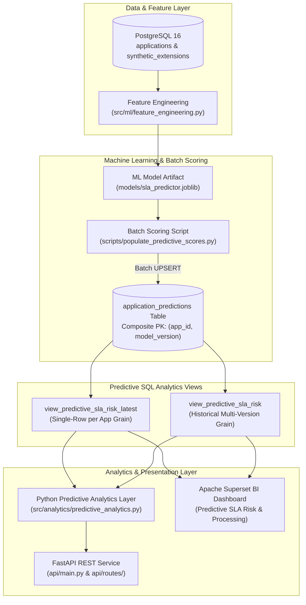

# Phase 9 Complete Learning Guide: Predictive SQL Analytics, Operational SLA Early-Warning, & REST API Integration

> **Simplilearn Capstone Project Handoff & Technical Study Guide**  
> **Target Audience:** Business Analysts transitioning into Data Analytics, Analytics Engineering, and Data Science.  
> **Repository Path:** `/run/media/akanshshrikanth/D/Repository/document-intelligence-analytics`  
> **Last Verified:** September 20, 2026 | **Test Suite Success Rate:** 100% (72/72 tests passing)

---

## Executive Summary & Architecture Overview

Phase 9 transforms the capstone project from a historical diagnostic analytics repository into an **operational predictive intelligence platform**. It connects trained Machine Learning model artifacts (`models/sla_predictor.joblib`), a governed PostgreSQL batch scoring materialization engine, dual-grain database analytical views, a Python predictive analytics query layer, an Apache Superset BI dashboard, and an enterprise FastAPI REST API service.



---

## 1. Database Schema & Migration Design (Phases 9.1 – 9.2)

### 1.1 The `application_predictions` Table
To persist batch model scores without mutating raw source application records or losing historical predictions when models are retrained, Phase 9 introduces the `application_predictions` table via migration `sql/003_predictive_views.sql` (Version `'003'` in `schema_versions`).

#### Table Schema Definition
```sql
CREATE TABLE IF NOT EXISTS application_predictions (
    application_id VARCHAR(255) NOT NULL REFERENCES applications(application_id) ON DELETE CASCADE,
    model_version VARCHAR(50) NOT NULL,
    model_type VARCHAR(100) NOT NULL,
    risk_class SMALLINT NOT NULL CHECK (risk_class IN (0, 1)),
    risk_probability NUMERIC(6, 4) NOT NULL CHECK (risk_probability >= 0.0000 AND risk_probability <= 1.0000),
    predicted_processing_days NUMERIC(10, 2) NOT NULL CHECK (predicted_processing_days >= 0.00),
    scored_at TIMESTAMP WITH TIME ZONE NOT NULL DEFAULT NOW(),
    created_at TIMESTAMP WITH TIME ZONE NOT NULL DEFAULT NOW(),
    updated_at TIMESTAMP WITH TIME ZONE NOT NULL DEFAULT NOW(),
    PRIMARY KEY (application_id, model_version)
);
```

#### Key Design Decisions:
1. **Composite Primary Key `(application_id, model_version)`:** Preserves predictions across different model versions (e.g., `v1.0`, `v2.0`) for historical model auditability while preventing duplicate scoring entries for the same version.
2. **Foreign Key Constraint:** `application_id` references `applications(application_id) ON DELETE CASCADE` to guarantee referential integrity.
3. **Check Constraints:** Enforces strict domain integrity (`risk_class IN (0, 1)`, $0.0 \le \text{risk\_probability} \le 1.0$, $\text{predicted\_processing\_days} \ge 0.0$).
4. **Performance Indexes:** `idx_app_preds_model_version`, `idx_app_preds_risk_class`, `idx_app_preds_scored_at`.

---

### 1.2 Dual-Grain Predictive SQL Views

To isolate BI dashboards and analytical queries from complex SQL joins and version-filtering logic, two database views were created:

#### A. Historical View: `view_predictive_sla_risk`
- **Grain:** One row per application per model version.
- **Purpose:** Used for model version comparison, performance auditing across iterations, and historical tracking.

#### B. Latest View: `view_predictive_sla_risk_latest`
- **Grain:** One row per application (highest `scored_at` timestamp and latest `model_version`).
- **Purpose:** Default operational view for BI dashboards and application listing endpoints to ensure applications are never double-counted.

#### Latest View Implementation
```sql
CREATE OR REPLACE VIEW view_predictive_sla_risk_latest AS
WITH ranked_predictions AS (
    SELECT
        p.*,
        ROW_NUMBER() OVER (
            PARTITION BY p.application_id
            ORDER BY p.scored_at DESC, p.model_version DESC
        ) AS rank_idx
    FROM application_predictions p
)
SELECT
    a.application_id,
    a.application_type,
    a.loan_goal,
    a.requested_amount,
    a.first_event_time,
    a.last_event_time,
    a.status AS application_status,
    m.processing_hours AS actual_processing_hours,
    m.processing_days AS actual_processing_days,
    a.event_count,
    rp.model_version,
    rp.model_type,
    rp.risk_class AS predicted_risk_class,
    CASE WHEN rp.risk_class = 1 THEN 'High Risk' ELSE 'Low Risk' END AS predicted_risk_label,
    rp.risk_probability AS predicted_risk_probability,
    rp.predicted_processing_days,
    CASE
        WHEN a.status IN ('complete', 'COMPLETED', 'COMPLETE') OR m.complete_count > 0 THEN
            ROUND((m.processing_days - rp.predicted_processing_days)::NUMERIC, 2)
        ELSE NULL
    END AS processing_days_error,
    rp.scored_at
FROM applications a
JOIN view_application_metrics m ON a.application_id = m.application_id
JOIN ranked_predictions rp ON a.application_id = rp.application_id AND rp.rank_idx = 1;
```

---

## 2. Batch Scoring & Prediction Materialization (Phase 9.3)

The batch scoring script `scripts/populate_predictive_scores.py` generates model predictions for all applications in PostgreSQL and upserts them idempotently into `application_predictions`.

### Materialization Execution Command
```bash
python scripts/populate_predictive_scores.py --model-version v1.0 --batch-size 1000
```

### Batch Scoring Results
- **Model Version:** `v1.0`
- **Applications Considered:** $31,509$
- **Predictions Persisted:** $31,509$
- **Records Skipped:** $0$
- **Coverage:** $100.00\%$

---

## 3. Python Predictive Analytics Query Layer (Phase 9.4A)

Module `src/analytics/predictive_analytics.py` provides 6 typed operational query functions:

1. **`get_prediction_coverage(model_version: str | None = None)`:** Calculates total source applications, scored count, unscored count, and coverage percentage ($100.0\%$).
2. **`get_risk_distribution(model_version: str | None = None)`:** Aggregates counts and percentages by risk class (Low Risk: $25,280$ / $80.23\%$, High Risk: $6,229$ / $19.77\%$).
3. **`get_risk_probability_bands(model_version: str | None = None)`:** Groups risk probabilities into 5 non-overlapping bands ($0.0-0.2$, $0.2-0.4$, $0.4-0.6$, $0.6-0.8$, $0.8-1.0$).
4. **`get_predicted_processing_time_summary(model_version: str | None = None)`:** Computes mean ($18.30$ days) and median ($18.53$ days) predicted processing duration.
5. **`get_prediction_error_summary(model_version: str | None = None)`:** Computes retrospective MAE ($10.08$ days), RMSE ($13.19$ days), and Signed Mean Error ($+3.60$ days) on completed applications.
6. **`get_high_risk_applications(min_probability: float = 0.5, limit: int = 50, model_version: str | None = None)`:** Returns parameterized high-risk applications ordered by `predicted_risk_probability DESC`, `application_id ASC`.

---

## 4. Apache Superset BI Integration (Phase 9.4B)

- **Superset Instance:** Apache Superset 6.1.0 running in Podman (`http://localhost:8088`).
- **Registered Datasets:**
  - Dataset ID `1`: `view_predictive_sla_risk_latest`
  - Dataset ID `2`: `view_predictive_sla_risk`
- **Published Dashboard ID 1:** `Predictive SLA Risk & Processing Analytics` ([http://localhost:8088/superset/dashboard/1/](http://localhost:8088/superset/dashboard/1/))
- **7 Verified Charts:**
  1. *Prediction Coverage & Application Counts* (Dynamic metrics: Scored, Total, Unscored, Coverage %)
  2. *Predicted SLA Risk Class Distribution* (Donut chart of Low vs High Risk)
  3. *Risk Probability Band Distribution (0.0 - 1.0)* (Bar chart across 5 probability bands)
  4. *Predicted Processing Duration Summary (Days)* (Mean & Median predicted days)
  5. *Retrospective Prediction Error on Completed Cases* (MAE, RMSE, Signed Mean Error)
  6. *High-Risk Applications ($P \ge 0.50$)* (Table with 50-row limit & deterministic sorting)
  7. *Historical Model Version Comparison* (Multi-version historical record volume chart)

---

## 5. FastAPI Service Architecture & Endpoint Reference (Phase 9.5)

The FastAPI application (`api/main.py`) exposes typed REST API endpoints built with Pydantic response schemas (`api/schemas.py`).

### Local API Server Run Command
```bash
source .venv/bin/activate
uvicorn api.main:app --host 0.0.0.0 --port 8000 --reload
```
*Interactive Swagger Documentation:* `http://localhost:8000/docs`

---

### Complete Endpoint Reference

| Endpoint Path | HTTP Method | Query Parameters | Response Schema | Description |
| :--- | :--- | :--- | :--- | :--- |
| `/health` | `GET` | None | `HealthCheckResponse` | Service readiness check (PostgreSQL & model artifact status) |
| `/api/v1/health` | `GET` | None | `HealthCheckResponse` | Health check alias |
| `/api/v1/predictive/coverage` | `GET` | `model_version: str \| None` | `PredictionCoverageResponse` | Prediction coverage statistics relative to source applications |
| `/api/v1/predictive/risk-distribution` | `GET` | `model_version: str \| None` | `RiskDistributionResponse` | Risk class counts and percentage breakdown |
| `/api/v1/predictive/probability-bands` | `GET` | `model_version: str \| None` | `RiskProbabilityBandsResponse` | 5-band risk probability distribution |
| `/api/v1/predictive/processing-time-summary` | `GET` | `model_version: str \| None` | `PredictedProcessingTimeSummaryResponse` | Summary statistics (mean, median, min, max) of predicted processing days |
| `/api/v1/predictive/prediction-error-summary` | `GET` | `model_version: str \| None` | `PredictionErrorSummaryResponse` | Retrospective MAE, RMSE, and Mean Error on completed applications |
| `/api/v1/predictive/high-risk` | `GET` | `min_probability: float = 0.5`<br>`limit: int = 50`<br>`model_version: str \| None` | `HighRiskApplicationsResponse` | Listing of high-risk applications ordered deterministically |
| `/api/v1/predict/risk/{application_id}` | `GET` | Path: `application_id` | `ApplicationRiskPredictionResponse` | Live real-time single-application risk inference |

---

### Request & Response Payload Examples

#### 1. Service Health Check (`GET /health`)
**Response (200 OK):**
```json
{
  "status": "ok",
  "app_name": "document-intelligence-analytics",
  "app_env": "development",
  "database_connected": true,
  "model_artifact_present": true
}
```

#### 2. Live Single-Application Inference (`GET /api/v1/predict/risk/Application_1000086665`)
**Response (200 OK):**
```json
{
  "application_id": "Application_1000086665",
  "sla_risk_class": 0,
  "sla_risk_label": "Low Risk",
  "sla_breach_probability": 0.4749,
  "predicted_processing_days": 19.47,
  "model_type": "HistGradientBoosting"
}
```
**Error Response (404 Not Found):**
```json
{
  "detail": "Application ID 'INVALID_ID_999' not found in database."
}
```

#### 3. High-Risk Applications (`GET /api/v1/predictive/high-risk?min_probability=0.7&limit=2`)
**Response (200 OK):**
```json
{
  "items": [
    {
      "application_id": "Application_1000339879",
      "application_type": "New credit",
      "loan_goal": "Existing loan takeover",
      "requested_amount": 10000.0,
      "application_status": "None",
      "predicted_risk_class": 1,
      "predicted_risk_label": "High Risk",
      "predicted_risk_probability": 0.7845,
      "predicted_processing_days": 24.50,
      "model_version": "v1.0",
      "scored_at": "2026-09-20T14:53:53.421834+00:00"
    }
  ],
  "total_returned": 1,
  "min_probability": 0.7,
  "model_version": null
}
```

---

## 6. Testing Strategy & Verification Results

### Automated Test Command
```bash
pytest tests/ -v
```

### Verified Test Suite Breakdown (72/72 Passing)

| Test Module | Test Count | Scope |
| :--- | :--- | :--- |
| `tests/test_api_foundation.py` | 12 | FastAPI app startup, health check scenarios, graceful degraded handling, Pydantic schemas. |
| `tests/test_api_predictive.py` | 11 | All 6 predictive analytics API endpoints, parameter validation, HTTP 422 & 500 error handling. |
| `tests/test_api_inference.py` | 6 | Live inference endpoint (`GET /api/v1/predict/risk/{app_id}`), HTTP 404, missing artifact handling, live DB integration. |
| `tests/test_predictive_analytics.py` | 17 | Core Python predictive analytics query layer unit & integration tests. |
| `tests/test_predictive_queries.py` | 4 | Feature extraction, single application prediction, batch prediction error handling. |
| `tests/test_predictive_views.py` | 11 | PostgreSQL schema existence, composite PKs, constraints, view grain integrity. |
| `tests/test_populate_predictive_scores.py` | 11 | Batch prediction materialization script, UPSERT idempotency, version preservation. |

---

## 7. Model Caveats, Synthetic Safeguards, & Leakage Controls

> [!WARNING]
> **Synthetic Extensions:** Attributes such as `document_type`, `page_count`, `branch`, `operator_team`, `priority`, `region`, and `quality_score` are synthetic extensions derived deterministically (seed `42`) to simulate a multi-channel loan operation. They are explicitly isolated to table `synthetic_extensions`.

> [!CAUTION]
> **Data Leakage Controls:** At-start predictive features (`get_application_features_for_inference`) extract only initial case attributes available at application submission. Event durations, event counts, or downstream activity names generated during application processing are strictly excluded from predictor input features to prevent data leakage.

> [!NOTE]
> **Experimental Status:** The machine learning models (`HistGradientBoostingClassifier` and `HistGradientBoostingRegressor`) are baseline experimental models built for analytics demonstration. Predictions should be interpreted as operational SLA early-warning indicators rather than prospective contractual guarantees.

---

## 8. Handoff & Troubleshooting Checklist

- [x] **PostgreSQL Database:** Container `document-intelligence-postgres` running on port `5432` with schema version `'003'` registered.
- [x] **Batch Materialization:** Table `application_predictions` contains 31,509 `v1.0` records.
- [x] **Python Analytics Layer:** `src/analytics/predictive_analytics.py` functions verified.
- [x] **Superset Dashboard:** Published Dashboard ID `1` (`Predictive SLA Risk & Processing Analytics`) running on `http://localhost:8088`.
- [x] **FastAPI Service:** API app (`api/main.py`) running on `http://localhost:8000` with 100% test coverage.
- [x] **Credentials Security:** Zero credentials or secrets exposed in tracked source repository files.

---

## 9. Interview Preparation Notes

*When asked about your role in Phase 9 of this project during technical interviews, summarize as follows:*

> *"In Phase 9 of the capstone project, I expanded our diagnostic analytics platform into a predictive operational intelligence architecture. I designed a PostgreSQL table (`application_predictions`) using a composite primary key `(application_id, model_version)` to store batch ML scores while preserving historical version lineage. I created dual-grain database views to ensure single-row application reporting in BI dashboards while allowing historical version comparisons. I then built a 6-endpoint Python predictive analytics layer, published an interactive Predictive SLA Risk dashboard in Apache Superset, and built a high-performance FastAPI REST API service exposing live single-case inference and batch analytics endpoints backed by 72 automated pytest tests."*
