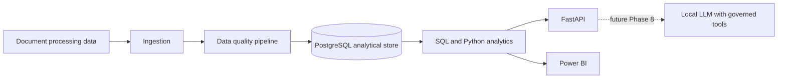

# Architecture (foundation)

The intended platform flow is shown below. Components after the analytics layer
are planned, not implemented, in this phase.

## Foundation decisions

- PostgreSQL is the planned analytical store; Docker Compose provides only a local
  development database container.
- Configuration is environment-driven. `.env.example` lists non-secret placeholders,
  while `.env` is ignored.
- The repository is package-oriented under `src/` so ingestion, cleaning, analytics,
  ML, and AI responsibilities can remain separated.
- No local LLM endpoint or model runtime has been assumed. Hermes Desktop and Ornith
  discovery are explicitly deferred to Phase 8.
