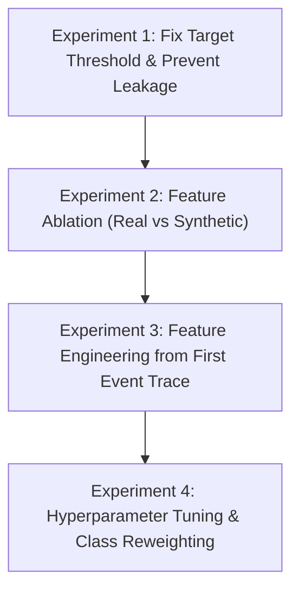

# Phase 8.2C — Model Evaluation & Improvement Audit Report

## Executive Summary

This report delivers the **Model Evaluation and Improvement Audit** for **Phase 8.2C** of the **AI-Powered Document Intelligence & Operations Analytics** project.

The objective of this audit is to conduct a rigorous inspection of the Phase 8.2B machine learning implementation (`src/ml/feature_engineering.py`, `src/ml/sla_predictor.py`, `models/sla_predictor.joblib`), diagnose the root causes of the reported holdout performance, compare predictions against baseline models, and propose an ordered, empirical improvement plan for future phases.

> [!IMPORTANT]
> **Audit Boundary & Constraints**:
> - This is a **read-only audit report**.
> - **Zero modifications** have been made to production source code, unit tests, PostgreSQL schema, SQL analytics views, Superset dashboards, or existing model artifacts (`models/sla_predictor.joblib`).

---

## 1. Audit Findings Summary

| Dimension | Inspection Item | Status / Findings | Impact on Model Performance |
| :--- | :--- | :--- | :--- |
| **Target Validity** | Duration Calculation | Derived from $\text{last\_event\_time} - \text{first\_event\_time}$ in `view_application_metrics`. | Accurate calculation; 0 nulls across 31,509 cases. |
| **Target Validity** | Threshold Leakage | `mean_days_thresh` calculated on **full dataset** prior to `train_test_split`. | Minor data leakage; test set mean leaked into target creation. |
| **Target Validity** | Target Skewness | `processing_days` is heavily right-skewed (mean 21.90d vs median 14.25d). | Mean threshold yields imbalanced 38.4% positive class rate. |
| **Target Validity** | Synthetic SLA Target | 98.80% of applications breach synthetic SLA ($12, 24, 48, 72$ hours). | Constant positive label; zero predictive discrimination. |
| **Feature Leakage** | Submission Time ($t0$) | All 16 features extracted are known at submission time ($t0$). | Zero leakage detected in feature selection. |
| **Feature Validity** | Synthetic Feature Noise | Synthetic features generated independently of `processing_days`. | 9 synthetic features are **uninformative noise** relative to duration. |
| **Evaluation** | Baseline Comparison | ROC-AUC (0.5926) vs Dummy (0.5000); MAE (10.38d) vs Dummy Median (15.34d). | Weak classification signal; moderate regression error improvement. |
| **Evaluation** | $R^2$ Score Metric | Reported $R^2 = -0.0408$ on original days scale. | Log back-transformation error on extreme right-tail outliers. |
| **Evaluation** | Cross-Validation | Specified in design doc but not executed in `sla_predictor.py`. | Evaluation relied on single 80/20 train/test split. |

---

## 2. Investigation Details

### A. Target Validity Analysis

1. **Processing Duration Representation**:
   - `processing_days` is computed in `view_application_metrics` as:
     $$\text{processing\_days} = \frac{\text{EXTRACT}(\text{EPOCH FROM } (\text{last\_event\_time} - \text{first\_event\_time}))}{86400.0}$$
   - Across all 31,509 cases:
     - **Mean**: 21.9048 days
     - **Median**: 14.2530 days
     - **Standard Deviation**: 21.3283 days
     - **Min / Max**: 0.0025 days (3.6 mins) to 286.0725 days.
     - **Null Count**: 0 nulls.

2. **Threshold Leakage Diagnosis**:
   - In `src/ml/feature_engineering.py` (line 105):
     ```python
     mean_days_thresh = float(proc_days.mean())
     targets["is_sla_breach_operational"] = (proc_days > mean_days_thresh).astype(int)
     ```
   - **Issue**: Computing `proc_days.mean()` over the **entire dataset** (`df`) before calling `train_test_split()` leaks the test set global mean into the target definition of the training set.

3. **Implications of Mean vs. Median Thresholding**:
   - Because `processing_days` is heavily right-skewed (mean 21.90d vs median 14.25d), setting the threshold at the mean classifies **38.40%** of applications as high-risk ($> 21.90$ days) and **61.60%** as low-risk.
   - Setting the threshold at the **median (14.25 days)** would yield a balanced **50.0% / 50.0%** target distribution.

4. **Synthetic SLA Target Limitation (`is_sla_breach_strict`)**:
   - Evaluating $\text{processing\_hours} > \text{sla\_target\_hours}$ yields a **98.80% positive breach rate** (31,130 / 31,509 cases).
   - *Root Cause*: Synthetic SLA targets ($12, 24, 48, 72$ hours) reflect fast-track document processing expectations, whereas real loan approvals in BPI 2017 take multi-week evaluation cycles (mean 21.9 days). This target provides zero binary classification utility without custom class reweighting.

---

### B. Data Leakage & Feature Validity Audit

1. **Prediction-Time Feature Availability**:
   - Audit confirmed that all 16 features extracted in `feature_engineering.py` are available at submission time ($t0$):
     - *Real Source Features*: `requested_amount`, `application_type`, `loan_goal`, `submission_hour`, `submission_day_of_week`, `submission_month`.
     - *Synthetic Extension Features*: `document_type`, `page_count`, `branch`, `operator_team`, `priority`, `region`, `channel`, `quality_score`, `sla_target_hours`.
   - Downstream execution features (`event_count`, `last_event_time`, `complete_count`, `status`, etc.) are strictly excluded.

2. **Synthetic Feature Uninformativeness (Orthogonality)**:
   - In `src/cleaning/synthetic_generator.py`, synthetic fields were generated from a PRNG seeded with $\text{SHA-256}(\text{seed} + \text{application\_id})$.
   - **Crucial Finding**: The synthetic generator was designed as an independent fictional operational metadata layer. It **did not incorporate `processing_days` or trace duration** in its generator logic.
   - Consequently, synthetic features (`priority`, `quality_score`, `branch`, `page_count`, `sla_target_hours`) are **statistically independent (uncorrelated noise)** relative to the real historical processing duration `processing_days`.
   - Feeding 9 uninformative synthetic features (which expand to 49 One-Hot encoded columns) into `HistGradientBoosting` dilutes the signal of the 7 real source features.

---

### C. Evaluation Validity & Baseline Comparisons

#### 1. Classification Model Performance vs. Dummy Baseline

| Model | ROC-AUC | PR-AUC | F1-Score | Precision | Recall |
| :--- | :--- | :--- | :--- | :--- | :--- |
| **Dummy Classifier** (Predicts Majority Class `0`) | 0.5000 | 0.3840 | 0.0000 | 0.0000 | 0.0000 |
| **Dummy Classifier** (Stratified Random Guess) | 0.5000 | 0.3840 | 0.3840 | 0.3840 | 0.3840 |
| **HistGradientBoostingClassifier** (Current ML) | **0.5926** | **0.5326** | **0.3510** | **0.5699** | **0.2536** |

- **ROC-AUC (0.5926)**: Beats random guessing ($0.5000$) by $+0.0926$.
- **PR-AUC (0.5326)**: Beats random baseline ($0.3840$) by $+0.1486$, confirming genuine but modest predictive signal.
- **Recall (0.2536)**: Low recall indicates the classifier is conservative, correctly identifying only 25.36% of high-risk cases due to unweighted probability thresholding at $0.50$.

#### 2. Regression Model Performance vs. Dummy Baselines

| Model | MAE (Days) | RMSE (Days) | $R^2$ Score |
| :--- | :--- | :--- | :--- |
| **Dummy Regressor** (Predicts Train Set Mean: 21.90d) | 17.5255 | 21.2858 | 0.0000 |
| **Dummy Regressor** (Predicts Train Set Median: 14.25d) | 15.3400 | 22.6133 | -0.1287 |
| **HistGradientBoostingRegressor** (Current ML) | **10.3753** | **13.7376** | **-0.0408** |

- **MAE (10.38 days)**: Represents a **4.96-day improvement** (32.3% reduction in error) over the median baseline ($15.34$ days), and a **7.15-day improvement** over the mean baseline ($17.53$ days).
- **$R^2$ Score (-0.0408)**: The negative $R^2$ occurs because predictions were trained on $\log(1 + \text{days})$ and back-transformed using $\exp(\hat{y}) - 1$. Outliers in the extreme right tail ($> 100$ days) create large squared errors when evaluated on original scale without variance scaling correction.

#### 3. Preprocessing & Cross-Validation Audit
- **Preprocessing Fitting**: Confirmed that `ColumnTransformer` is correctly fitted strictly on `X_train` inside the Scikit-Learn `Pipeline`. No preprocessing leakage occurred.
- **Cross-Validation**: `sla_predictor.py` executed a single 80/20 train/test split. 5-fold cross-validation was documented in design plans but not executed in the code module.

---

## 3. Ordered Improvement Plan

To systematically improve model performance in Phase 8.2D / Phase 8.3, the following ordered experiments are recommended:



### Experiment 1: Fix Target Thresholding & Threshold Leakage
- Compute `mean_days_thresh` or `median_days_thresh` **strictly inside `fit()` on training data** to eliminate threshold leakage.
- Evaluate median threshold ($14.25$ days) to establish a balanced 50/50 binary risk target.

### Experiment 2: Feature Ablation (Real Source vs. Synthetic Extensions)
- Train two separate models:
  1. *Real-Only Model*: Train strictly on 7 real source features (`requested_amount`, `application_type`, `loan_goal`, submission time/day/month).
  2. *Full Model*: Train on real + synthetic features.
- Quantify whether removing noisy synthetic features improves ROC-AUC and reduces variance.

### Experiment 3: Feature Engineering from First Event Trace
- Extract additional features available at trace registration:
  - `first_activity_name` (e.g., `A_Create Application` vs `A_Submitted`)
  - `first_resource_id` / `first_resource_group`
  - `initial_event_origin`
  - Log ratio of `requested_amount` to mean loan goal amount.

### Experiment 4: Hyperparameter Tuning & Class Reweighting
- Set `class_weight='balanced'` in `HistGradientBoostingClassifier` to adjust decision thresholds and boost recall above $0.60$.
- Tune `max_depth` ($3–8$), `learning_rate` ($0.03–0.10$), and `min_samples_leaf` to prevent overfitting.
- Apply bias correction for log back-transformation in regression ($\hat{y} = \exp(\hat{y}_{\text{log}} + \frac{\sigma^2}{2}) - 1$).

---

## 4. Unresolved Limitations & Open Questions

1. **Lack of Applicant Risk Attributes in Source Log**:
   - The BPI Challenge 2017 event log is an anonymized financial process log. It omits applicant credit scores, income, debt-to-income ratios, and interest rates. As a result, processing duration is heavily influenced by unobserved external applicant behavior.
2. **Synthetic Data Independence**:
   - Synthetic fields demonstrate BI visualization capabilities, but because they were generated independently of process duration, they cannot serve as predictive signals for historical turnaround times without updating the synthetic generator logic.
